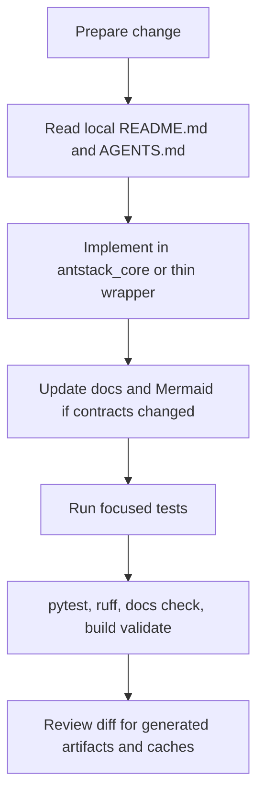

# Contributing

Contributions should preserve the current Ant Stack contracts: `uv` for Python execution, `bun` for Node/Mermaid tooling, package-owned logic in `antstack_core`, thin scripts and CLIs, documented outputs, and source-backed scientific prose.



## Development Rules

- Use `uv run` for Python commands and dependency-managed execution.
- Use `bun` for Mermaid and Node-backed document tooling.
- Keep business logic in `antstack_core`; keep `scripts/` and `antstack_core/cli/` as thin wrappers.
- Keep public APIs exported through module `__all__` when they are intended for users.
- Preserve generated artifacts only when they are intentional, reproducible, and documented by a command.
- Do not edit manuscript scientific claims unless they are source-backed or explicitly softened.

## Setup

```bash
uv sync --extra dev
bun install
```

## Validation Before Review

Run the focused tests for the changed area, then run:

```bash
uv run pytest --collect-only -q
uv run pytest -q
uv run ruff check .
uv run python tools/ensure_folder_docs.py --check
uv run antstack-build --validate-only
uv run run-all-antstack --config configs/run_all_antstack.example.yaml --validate-only
```

When changing canonical output generation, also run:

```bash
uv run run-all-antstack --config configs/run_all_antstack.example.yaml
```

When changing complexity energetics compatibility outputs, also run:

```bash
uv run antstack-ce papers/complexity_energetics/manifest.example.yaml --out papers/complexity_energetics/out
```

## Documentation Expectations

- Keep `README.md` and `docs/README.md` aligned with current commands, output roots, and test status.
- Add or update Mermaid diagrams in substantive guides when workflow, architecture, or data flow changes.
- Keep folder-level README/AGENTS signposts short and accurate.
- Validate documentation coverage with `uv run python tools/ensure_folder_docs.py --check`.

## Generated Files

Before handing off a change, remove bytecode, cache directories, OS metadata, and transient test artifacts outside `.venv`. Keep `outputs/<run_id>/` artifacts only when they are intentional outputs for the requested change.
