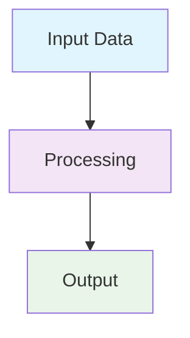

# PDF Rendering System Guide: Reliable Paper Syntax

## Overview

This guide documents the comprehensive PDF rendering system used across all Ant Stack papers, providing reliable syntax patterns for consistent, professional scientific publications.

## System Architecture

### Core Components

1. **Modular Build System** (`scripts/common_pipeline/build_core.py`)
   - YAML-based paper configuration
   - Automatic paper discovery and validation
   - Cross-reference validation before PDF generation
   - Quality assurance reporting

2. **Legacy Render System** (`tools/render_pdf.sh`)
   - Pandoc + XeLaTeX pipeline
   - Mermaid diagram prerendering
   - Unicode math symbol handling
   - Cross-reference validation

3. **Core Package** (`antstack_core/`)
   - Figure generation and management
   - Cross-reference validation
   - Asset organization
   - Publication-ready formatting

## Paper Configuration System

### YAML Configuration Structure

Each paper requires a `paper_config.yaml` file with this structure:

```yaml
# Paper metadata
paper:
  name: "paper_name"
  title: "Paper Title"
  subtitle: "Subtitle"
  author: "Daniel Ari Friedman"
  email: "daniel@activeinference.institute"
  orcid: "0000-0001-6232-9096"
  output_filename: "N_paper_name.pdf"

# Content organization
content:
  files:
    - "Abstract.md"
    - "Introduction.md"
    # ... other files in build order

# Asset management
assets:
  figures_dir: "assets/figures"
  mermaid_dir: "assets/mermaid"
  tmp_dir: "assets/tmp_images"
  data_dir: "assets/data"

# Build configuration
build:
  has_generated_content: true
  has_computational_analysis: true
  mermaid_preprocessing: true
  cross_reference_validation: true

# LaTeX/Pandoc settings
latex:
  document_class: "article"
  geometry: "margin=2.5cm"
  mainfont: "Latin Modern Roman"
  mathfont: "Latin Modern Math"
  bibliography: "references.bib"

# Quality assurance
validation:
  check_cross_references: true
  check_figure_captions: true
  check_unicode_symbols: true
  require_descriptive_links: true
  validate_analysis_outputs: true
```

## Figure Management System

### Figure Format (CRITICAL)

**ALWAYS use this exact format:**

```markdown
## Figure: Descriptive Title {#fig:identifier}


**Caption:** Detailed description of the figure content, including units and key findings.
```

**NEVER use:**
- `{#fig:id}` (inline figure definitions)
- `\includegraphics` commands in markdown
- Missing figure IDs or captions

### Figure Naming Conventions

- **IDs**: Use descriptive, hierarchical names: `energy_by_workload`, `scaling_brain_K`, `response_time_comparison`
- **Files**: Store in `assets/figures/` with descriptive names
- **References**: Use `\ref{fig:identifier}` for cross-references

### Example Figure Definition

```markdown
## Figure: Energy Scaling Analysis {#fig:energy_scaling}


**Caption:** Energy consumption scaling with system complexity K, showing 95% confidence intervals. The power law relationship $E \propto K^{\alpha}$ is evident with $\alpha \approx 1.2$.
```

## Cross-Reference System

### Reference Types

1. **Figures**: `\ref{fig:identifier}` → "Figure 1"
2. **Equations**: `\ref{eq:identifier}` → "Equation (1)"
3. **Sections**: `\ref{sec:identifier}` → "Section 2.1"
4. **Tables**: `\ref{tab:identifier}` → "Table 3"

### Section IDs

Use descriptive IDs in section headers:

```markdown
# Introduction {#sec:introduction}

## Methodology {#sec:methodology}

### Data Collection {#sec:data_collection}
```

### Equation Format

```markdown
\begin{equation}
E = \sum_{i=1}^{n} \alpha_i \cdot K_i^{\beta_i}
\label{eq:energy_scaling}
\end{equation}
```

Reference with: `\ref{eq:energy_scaling}`

## Mathematics and Symbols

### LaTeX Math Syntax

**ALWAYS use LaTeX macros, NEVER Unicode symbols:**

```markdown
# Correct
$\mu$, $\lambda$, $\pi$, $\epsilon$, $\Delta$, $\rho$, $\sigma$

# Incorrect  
μ, λ, π, ε, Δ, ρ, σ
```

### Common Symbol Mappings

| Symbol | LaTeX | Usage |
|--------|-------|-------|
| μ | `$\mu$` | Micrometers, mean |
| λ | `$\lambda$` | Wavelength |
| π | `$\pi$` | Pi constant |
| ε | `$\epsilon$` | Epsilon |
| Δ | `$\Delta$` | Delta, change |
| ρ | `$\rho$` | Density, correlation |
| σ | `$\sigma$` | Standard deviation |
| ± | `$\pm$` | Plus-minus |
| ≤ | `$\le$` | Less than or equal |
| ≥ | `$\ge$` | Greater than or equal |
| ≈ | `$\approx$` | Approximately |
| ∝ | `$\propto$` | Proportional to |

### Math Environments

```markdown
# Inline math
The energy is $E = mc^2$ joules.

# Display math
$$E = \sum_{i=1}^{n} \alpha_i \cdot K_i^{\beta_i}$$

# Numbered equation
\begin{equation}
E = \sum_{i=1}^{n} \alpha_i \cdot K_i^{\beta_i}
\label{eq:energy_scaling}
\end{equation}
```

## Hyperlinks and References

### External Links

Use descriptive hyperlinks with `\href{URL}{descriptive text}`:

```markdown
# Correct
\href{https://arxiv.org/abs/2505.03764}{arXiv preprint}

# Incorrect
\href{https://arxiv.org/abs/2505.03764}{arXiv preprint}
\url{https://arxiv.org/abs/2505.03764}
```

### Internal Cross-References

```markdown
# Section references
See \ref{sec:methodology} for details.

# Figure references  
As shown in \ref{fig:energy_scaling}, the relationship is clear.

# Equation references
From \ref{eq:energy_scaling}, we can derive...
```

## Mermaid Diagrams

### Prerendering System

Mermaid diagrams must be prerendered to local images:

1. **Source**: Store `.mmd` files in `assets/mermaid/`
2. **Rendered**: Convert to `.png` files in same directory
3. **Reference**: Use standard figure format

### Diagram Format

```markdown
## Figure: System Architecture {#fig:system_arch}

## Figure: System Architecture {#fig:system_arch}


**Caption:** High-level system architecture showing data flow between components.
```

### Mermaid Best Practices



## File Organization

### Directory Structure

```
papers/paper_name/
├── paper_config.yaml          # Paper configuration
├── Abstract.md                # Abstract
├── Introduction.md            # Introduction
├── Methodology.md             # Methods
├── Results.md                 # Results
├── Discussion.md              # Discussion
├── Conclusion.md              # Conclusion
├── References.md              # References
├── Appendices.md              # Appendices
├── assets/
│   ├── figures/              # Generated figures
│   ├── mermaid/              # Mermaid diagrams
│   ├── data/                 # Data files
│   └── tmp_images/           # Temporary images
└── references.bib            # Bibliography
```

### File Naming Conventions

- **Markdown files**: `PascalCase.md` (e.g., `Abstract.md`, `Introduction.md`)
- **Figure files**: `snake_case.png` (e.g., `energy_scaling.png`)
- **Data files**: `descriptive_name.json` (e.g., `analysis_results.json`)

## Build System Usage

### Command Line Interface

```bash
# Build all papers
python3 scripts/common_pipeline/build_core.py

# Build specific paper
python3 scripts/common_pipeline/build_core.py --paper paper_name

# Validate only (no PDF generation)
python3 scripts/common_pipeline/build_core.py --validate-only

# Skip tests
python3 scripts/common_pipeline/build_core.py --no-tests
```

### Legacy System

```bash
# Build all papers
bash tools/render_pdf.sh

# Build specific paper
bash tools/render_pdf.sh paper_name
```

## Quality Assurance

### Pre-Build Validation

The system automatically validates:

1. **Cross-references**: All `\ref{}` commands resolve to valid IDs
2. **Figure captions**: All figures have proper captions
3. **Math symbols**: Unicode symbols converted to LaTeX
4. **File structure**: All referenced files exist
5. **Configuration**: YAML syntax and required fields

### Post-Build Validation

1. **PDF quality**: File size, page count, figure count
2. **Broken references**: Detection of "Figure~??" patterns
3. **Mermaid rendering**: All diagrams successfully converted
4. **Cross-reference consistency**: Definitions match references

### Validation Reports

Build reports are generated in `build_report.md` with:

- Validation results summary
- Error details and fixes
- Quality metrics
- Performance statistics

## Test Suite Integration

### Test Categories

1. **Unit Tests**: Individual component validation
2. **Integration Tests**: Cross-module functionality
3. **Workflow Tests**: End-to-end pipeline validation
4. **Rendering Tests**: PDF generation and quality

### Running Tests

```bash
# All tests
python3 -m pytest tests/

# Specific component
python3 -m pytest tests/core_rendering/

# With coverage
python3 -m pytest --cov=antstack_core tests/
```

## Common Issues and Solutions

### Math Formatting Issues

**Problem**: `\mathrm allowed only in math mode`

**Solution**: Ensure all math is properly wrapped in `$...$` or `$$...$$`

```markdown
# Correct
$\mu\mathrm{m}$

# Incorrect
\(\mu\mathrm{m}\)
```

### Figure Reference Issues

**Problem**: `Figure~??` in PDF

**Solution**: Ensure figure IDs match exactly between definition and reference

```markdown
# Definition
## Figure: Title {#fig:my_figure}

# Reference
\ref{fig:my_figure}
```

### Cross-Reference Issues

**Problem**: Undefined references

**Solution**: Use `\ref{}` instead of `\Cref{}` unless cleveref is properly configured

```markdown
# Correct
\ref{fig:my_figure}

# May cause issues
\Cref{fig:my_figure}
```

## Best Practices Summary

### DO

- ✅ Use consistent figure format with IDs and captions
- ✅ Use LaTeX macros for all math symbols
- ✅ Use descriptive hyperlinks with `\href{}`
- ✅ Validate cross-references before building
- ✅ Use proper file organization
- ✅ Test with real data (no mocks)
- ✅ Generate comprehensive validation reports

### DON'T

- ❌ Use inline figure definitions
- ❌ Use Unicode math symbols in text
- ❌ Use naked URLs
- ❌ Skip cross-reference validation
- ❌ Use mock methods in tests
- ❌ Ignore build warnings

## Troubleshooting

### Build Failures

1. **Check math formatting**: Ensure all math is properly wrapped
2. **Validate cross-references**: Run `--validate-only` first
3. **Check file paths**: Ensure all referenced files exist
4. **Review YAML syntax**: Validate configuration files

### Quality Issues

1. **Broken references**: Check ID matching
2. **Missing figures**: Verify file paths and existence
3. **Math rendering**: Convert Unicode to LaTeX
4. **Cross-references**: Use consistent reference format

This guide ensures reliable, professional PDF generation across all Ant Stack papers with consistent formatting, proper cross-referencing, and comprehensive quality assurance.
