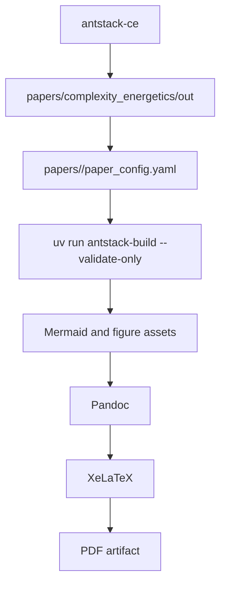

# PDF Rendering Guide

Ant Stack paper rendering is coordinated by `antstack-build`. Validation is available without external PDF dependencies; full PDF builds require Pandoc and a XeLaTeX-capable TeX installation.


```mermaid
flowchart TD
    Paper["papers/<name>/paper_config.yaml"] --> Validate["uv run antstack-build --validate-only"]
    Validate --> Assets["Mermaid and figure assets"]
    Assets --> Pandoc["Pandoc"]
    Pandoc --> XeLaTeX["XeLaTeX"]
    XeLaTeX --> PDF["PDF artifact"]
    CE["antstack-ce"] --> CEOut["papers/complexity_energetics/out"]
    CEOut --> Paper
```

## Readiness Validation

Use validation mode for CI and local checks that should not require PDF toolchains:

```bash
uv run antstack-build --validate-only
```

Validate one paper:

```bash
uv run antstack-build --paper complexity_energetics --validate-only
```

## Full PDF Build

Install optional tools first:

- Pandoc
- XeLaTeX or a compatible LaTeX distribution
- Project Node dependencies with `bun install`

Then run:

```bash
uv run antstack-build
```

## Complexity Energetics Inputs

The complexity energetics paper consumes generated content and figures. Regenerate them with:

```bash
uv run antstack-ce papers/complexity_energetics/manifest.example.yaml --out papers/complexity_energetics/out
```

For canonical run-all outputs and provenance, use:

```bash
uv run run-all-antstack --config configs/run_all_antstack.example.yaml
```

## Troubleshooting

- If validation fails, inspect the paper config, referenced content files, and local `assets/` directory.
- If Mermaid rendering fails, run `bun install` and then `uv run antstack-build --validate-only`.
- If PDF compilation fails, validate first; then check Pandoc and XeLaTeX availability.
