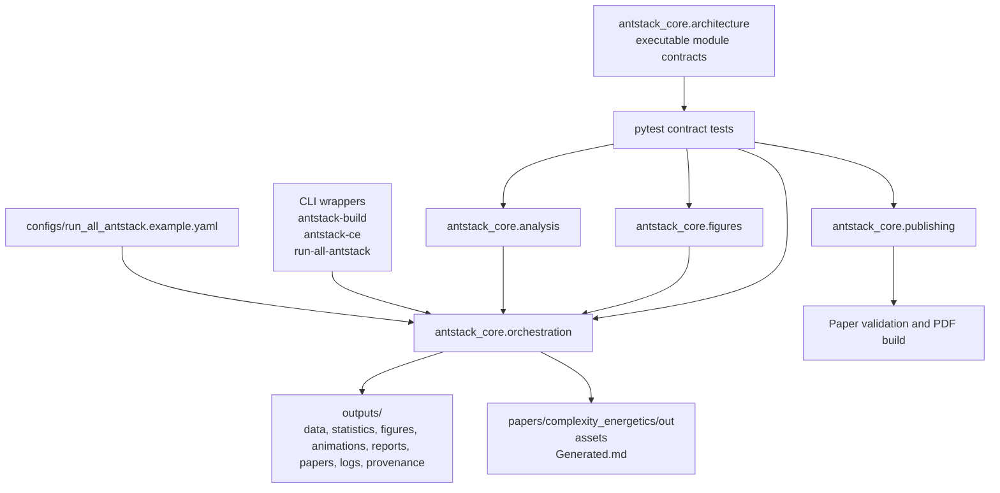

# Ant Stack

Ant Stack is a reproducible scientific-publication and analysis workspace for embodied AI, ant-inspired systems, complexity energetics, and publication rendering. The repository is organized as a `uv` Python project with `bun`-managed Node tooling for Mermaid and document workflows.

## Current State

- Python package: `antstack_core`
- CLI entrypoints: `antstack-build`, `antstack-ce`, and `run-all-antstack`
- Verified test suite: `676 passed, 10 subtests passed` with `uv run pytest -q`
- Package manager: `uv`
- Node/tooling manager: `bun`
- Paper roots: `papers/ant_stack`, `papers/complexity_energetics`, and `papers/documentation`
- Canonical generated output root: `outputs/<run_id>/`
- Compatibility complexity output root: `papers/complexity_energetics/out`

## Architecture



## Setup

```bash
uv sync --extra dev
bun install
```

Optional external document tools:

- `pandoc` for paper rendering
- LaTeX or XeLaTeX for PDF output
- Mermaid-compatible Node tooling for diagram rendering

## Common Commands

```bash
uv run pytest --collect-only -q
uv run pytest -q
uv run ruff check .
uv run python tools/ensure_folder_docs.py --check
uv run antstack-build --validate-only
uv run antstack-ce papers/complexity_energetics/manifest.example.yaml --out papers/complexity_energetics/out
uv run run-all-antstack --config configs/run_all_antstack.example.yaml
bun run test
bun run lint
bun run run:all
```

## Repository Layout

| Path | Purpose |
| --- | --- |
| `antstack_core/analysis` | Energy models, workloads, statistics, complexity analysis, power meters, experiment manifests, key numbers, and theoretical limits. |
| `antstack_core/architecture.py` | Executable architecture contract for package modules, folder signposting, public exports, layers, and Mermaid rendering. |
| `antstack_core/cohereants` | Cohereants APIs for spectroscopy, behavioral analysis, and physical conversion helpers. |
| `antstack_core/figures` | Matplotlib plots, publication figures, Mermaid helpers, figure references, and asset organization. |
| `antstack_core/orchestration` | Package-owned `run-all-antstack` orchestration, output layout, manifests, checksums, logs, and provenance. |
| `antstack_core/publishing` | Build orchestration, PDF helpers, validation, templates, and reference management. |
| `antstack_core/cli` | Thin console wrappers for package and paper workflows. |
| `configs/` | Validated YAML configs for canonical package workflows. |
| `outputs/` | Default canonical root for generated run artifacts under `outputs/<run_id>/`. |
| `papers/` | Manuscript sources, paper configs, assets, generated fragments, and paper-local runner code. |
| `scripts/` | Thin wrappers and operational utilities around package APIs. |
| `tests/` | Pytest suite for package APIs, rendering contracts, documentation contracts, and complexity energetics workflows. |
| `tools/` | Maintenance utilities and Pandoc Lua filters. |
| `docs/` | User and developer documentation, including empirical ant-data integration. |

For the current public API and CLI contract, start with [docs/public_api_contracts.md](docs/public_api_contracts.md).

## Generated Artifact Policy

Versioned generated plots, tables, PDFs, and manuscript fragments are kept only when they are intentional research artifacts with documented regeneration paths. Cache directories, Python bytecode, virtual environments, package build outputs, OS metadata, and transient test output should not be committed.

Generate canonical run artifacts with:

```bash
uv run run-all-antstack --config configs/run_all_antstack.example.yaml
```

Each run writes `outputs/<run_id>/manifest.json` plus provenance files under `outputs/<run_id>/provenance/`. The manifest records artifact type, path, producing task, source config, byte size, and SHA-256 checksum.

Regenerate compatibility complexity energetics outputs with:

```bash
uv run antstack-ce papers/complexity_energetics/manifest.example.yaml --out papers/complexity_energetics/out
```

## Documentation And Papers

- Documentation index: [docs/README.md](docs/README.md)
- Architecture contract: [docs/architecture.md](docs/architecture.md)
- Public API contracts: [docs/public_api_contracts.md](docs/public_api_contracts.md)
- External ant-data integration: [docs/external_ant_data_integration.md](docs/external_ant_data_integration.md)
- Paper roots: `papers/ant_stack`, `papers/complexity_energetics`, and `papers/documentation`
- Legacy generated comparison root: `complexity_energetics`

Every intentional directory has a local `README.md` and `AGENTS.md`. Verify coverage after structural changes:

```bash
uv run python tools/ensure_folder_docs.py --check
```
