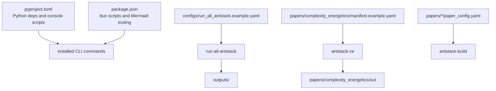

# Unified Configuration Summary

Ant Stack uses separate configuration layers for package execution, canonical run orchestration, and paper-specific builds. Keep scientific workload parameters in experiment manifests and orchestration behavior in run-all configs.

## Configuration Files

| File | Responsibility |
| --- | --- |
| `pyproject.toml` | Python package metadata, dependencies, pytest/Ruff settings, and console entrypoints. |
| `package.json` | Bun scripts and Mermaid-related Node dependencies. |
| `configs/run_all_antstack.example.yaml` | Canonical output generation, task selection, output root, logging, validation, visualization, and paper projection options. |
| `papers/complexity_energetics/manifest.example.yaml` | Scientific workload parameters for complexity energetics. |
| `papers/*/paper_config.yaml` | Paper content ordering, build settings, bibliography, and rendering metadata. |

## Rules

- Do not duplicate scientific workload schemas in orchestration config.
- Keep CLI examples on installed commands when available.
- Keep generated artifacts documented by the nearest README.
- Validate config readiness with `run-all-antstack --validate-only` and `antstack-build --validate-only`.
