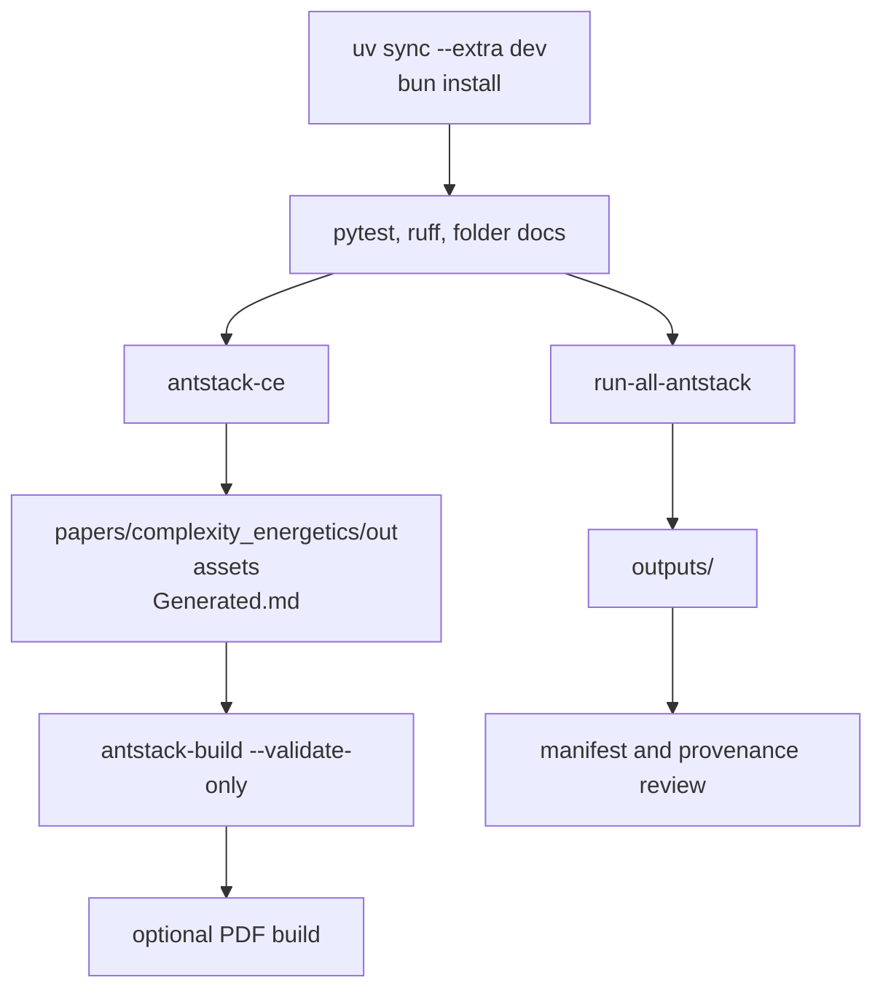

# Unified Workflow Guide

This guide summarizes the current end-to-end Ant Stack workflows for development, canonical output generation, compatibility paper artifacts, and publication validation.



## Development Workflow

```bash
uv sync --extra dev
bun install
uv run pytest --collect-only -q
uv run pytest -q
uv run ruff check .
uv run python tools/ensure_folder_docs.py --check
```

## Canonical Output Workflow

```bash
uv run run-all-antstack --config configs/run_all_antstack.example.yaml --validate-only
uv run run-all-antstack --config configs/run_all_antstack.example.yaml
```

Outputs are written under `outputs/<run_id>/` and include data, statistics, visualizations, animations, reports, papers, logs, manifests, and provenance.

## Complexity Energetics Compatibility Workflow

```bash
uv run antstack-ce papers/complexity_energetics/manifest.example.yaml --out papers/complexity_energetics/out
```

This keeps the existing complexity energetics paper build contract intact by updating paper-local outputs and assets.

## Paper Workflow

```bash
uv run antstack-build --validate-only
uv run antstack-build
```

Use full PDF builds only when Pandoc and LaTeX dependencies are available.

## Bun Script Equivalents

```bash
bun run test:collect
bun run test
bun run lint
bun run validate
bun run run:all
```
