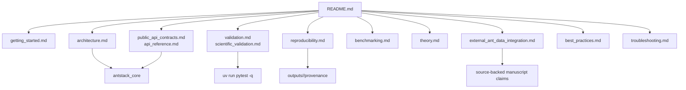

# Documentation

This directory contains the curated documentation for setup, architecture, API contracts, validation, reproducibility, benchmarking, theory, troubleshooting, publishing, and empirical ant-data integration.

## Guide Map



## Guides

| File | Purpose |
| --- | --- |
| `getting_started.md` | Setup, first validation, and first canonical output run. |
| `architecture.md` | Executable architecture contract, modular layers, and fractal repository rules. |
| `api_reference.md` | High-level API reference for package modules. |
| `public_api_contracts.md` | Current exported methods, CLI contracts, and validation commands. |
| `validation.md` | Required validation commands and acceptance gates. |
| `scientific_validation.md` | Scientific validation expectations for numerical and empirical claims. |
| `reproducibility.md` | Provenance, determinism, dependency, and artifact rules. |
| `benchmarking.md` | Benchmarking expectations and artifact locations. |
| `theory.md` | Conceptual model for body, brain, mind, energy, and complexity. |
| `best_practices.md` | Local development, documentation, visualization, and data practices. |
| `troubleshooting.md` | Common command, build, rendering, and data problems. |
| `external_ant_data_integration.md` | Schema, provenance, and validation contract for empirical ant datasets. |

## Folder-Docs Gate

`uv run python tools/ensure_folder_docs.py --check` passes: the checker reads
`.gitignore` directory patterns and skips registry entries they exclude (currently the
gitignored `papers/*/assets/tmp_images/` render-staging directories). Any other
missing-directory report is real documentation debt and should be fixed, not ignored.

## Local Commands

```bash
uv run python tools/ensure_folder_docs.py --check
uv run pytest -q
uv run ruff check .
uv run run-all-antstack --config configs/run_all_antstack.example.yaml --validate-only
```

Keep documentation claims aligned with source code, tests, and generated artifacts. Scientific prose should cite authoritative sources or explicitly mark assumptions and hypotheses.
