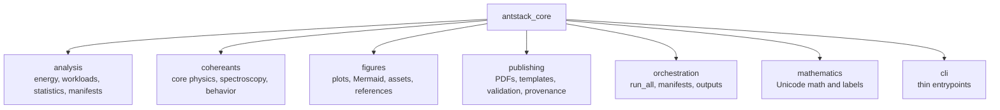

# API Reference

This guide summarizes the package modules. The enforceable public contract lives in [public_api_contracts.md](public_api_contracts.md) and the module `__all__` exports.



## Analysis

Use `antstack_core.analysis` for energy modeling, workload generation, bootstrap confidence intervals, scaling relationships, experiment manifests, key numbers, power meters, empirical reports, and theoretical limits.

Representative imports:

```python
from antstack_core.analysis import (
    EnergyCoefficients,
    ComputeLoad,
    estimate_compute_energy,
    bootstrap_mean_ci,
    analyze_scaling_relationship,
    ExperimentManifest,
)
```

## Figures

Use `antstack_core.figures` for basic plots, publication plots, Mermaid preprocessing, figure-reference validation, and asset organization.

Representative imports:

```python
from antstack_core.figures import (
    PlotConfig,
    bar_plot,
    line_plot,
    scatter_plot,
    preprocess_mermaid_diagrams,
)
```

## Orchestration

Use `antstack_core.orchestration` for canonical run-all workflows that produce data, statistics, visualizations, animations, reports, paper projections, logs, and provenance under `outputs/<run_id>/`.

Representative imports:

```python
from antstack_core.orchestration import RunAllConfig, run_all
```

## Publishing

Use `antstack_core.publishing` for build orchestration, PDF generation, templates, quality validation, references, and provenance metadata.

## Cohereants

Use `antstack_core.cohereants` for physical conversions, spectroscopy, CHC analysis, behavioral datasets, response statistics, and power analysis.

## Validation

```bash
uv run pytest -q tests/antstack_core/test_public_contracts.py
uv run pytest -q tests/antstack_core
```
