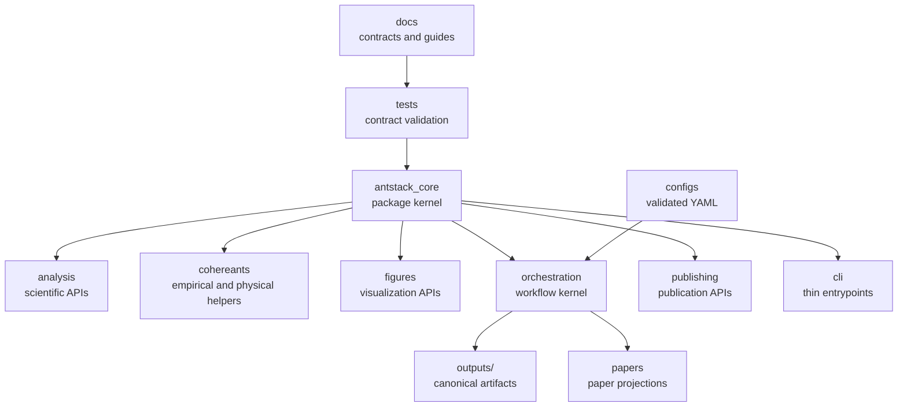

# Architecture

Ant Stack is organized as a modular scientific operating system for ant-inspired analysis and publishing: a small package kernel, thin command entrypoints, validated configs, canonical outputs, and local contracts at every folder level. The architecture is executable through `antstack_core.architecture`, so tooling can validate the tree instead of relying on prose.



## Executable Contract

Use the architecture API when adding modules, guides, workflows, or generated-output roots:

```python
from antstack_core.architecture import build_default_architecture, validate_architecture

architecture = build_default_architecture()
issues = validate_architecture()
```

The contract checks:

- every declared path exists;
- directory contracts have local `README.md` and `AGENTS.md`;
- package modules import cleanly;
- public exports listed by `__all__` resolve to real attributes;
- contract names remain unique across nested layers.

## Fractal Module Rule

Every layer should be independently understandable and composable:

- package modules expose importable methods, dataclasses, and explicit exports;
- CLIs and scripts delegate to package or paper-runner APIs;
- configs validate before generation;
- outputs carry manifests, checksums, logs, and provenance;
- docs state real commands and are guarded by tests;
- folder signposts stay short and local.

## Validation

```bash
uv run pytest -q tests/antstack_core/test_architecture_contract.py
uv run pytest -q tests/antstack_core/test_public_contracts.py
uv run python tools/ensure_folder_docs.py --check
```
