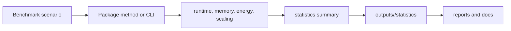

# Benchmarking

Benchmarking should measure real package methods or documented workflows and should write results to intentional output roots with provenance.



## Benchmark Targets

- Energy estimation and workload generation in `antstack_core.analysis`
- Statistical routines such as bootstrap confidence intervals and scaling analysis
- Visualization generation in `antstack_core.figures`
- Full run-all orchestration through `run-all-antstack`
- Paper validation through `antstack-build --validate-only`

## Reporting Rules

- Record command, input config, environment, and git state.
- Use stable seeds for stochastic or bootstrap runs.
- Keep benchmark claims tied to the hardware and dependency state that produced them.
- Avoid replacing focused tests with broad benchmark assertions.

## Commands

```bash
uv run pytest -q tests/complexity_energetics
uv run run-all-antstack --config configs/run_all_antstack.example.yaml
```
