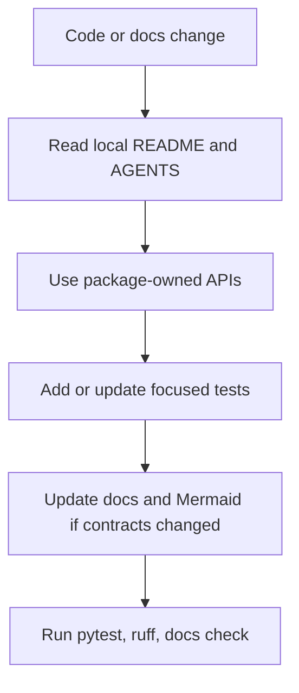

# Best Practices

These practices keep Ant Stack code, docs, and generated artifacts aligned with the current package contracts.



## Development

- Prefer package-owned implementation in `antstack_core`.
- Keep scripts and CLI wrappers thin.
- Use structured configs and dataclasses for workflow parameters.
- Use explicit exceptions for invalid inputs.
- Keep changes scoped to the directory contract described by local `README.md` and `AGENTS.md`.

## Documentation

- Update docs when commands, outputs, public APIs, or artifact policies change.
- Keep diagrams concise and source-controlled as fenced Mermaid blocks.
- Keep folder-level README/AGENTS files short unless the folder is a substantive guide.
- Do not claim generated artifacts are current unless their regeneration command has been run.

## Data And Outputs

- Put canonical run artifacts under `outputs/<run_id>/`.
- Keep compatibility paper artifacts only when the paper build needs them.
- Record provenance for generated data, figures, reports, and paper projections.
- Remove cache and bytecode artifacts outside `.venv`.

## Validation

```bash
uv run pytest -q
uv run ruff check .
uv run python tools/ensure_folder_docs.py --check
```
