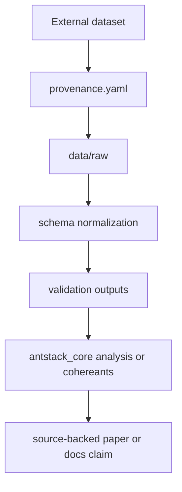

# External Ant Data Integration

This guide defines how empirical ant movement, pose, spectroscopy, and behavior datasets should enter Ant Stack analyses. Imported data must remain traceable, validated, and distinct from generated examples.



## Canonical Dataset Layout

```text
data/external/<dataset_id>/
  provenance.yaml
  raw/
  derived/
  validation/
  README.md
```

## Required Provenance

Each dataset needs:

- dataset id and version
- source organization or publication
- acquisition date
- license or use constraints
- species, colony, and experimental context when available
- measurement modality and units
- processing steps
- validation command and output path

## Normalized Schemas

Trajectory rows should include `frame`, `time_s`, `ant_id`, `x`, `y`, and coordinate units. Pose rows should include body landmarks, confidence values, and pixel-to-unit calibration when available. Behavioral event rows should include `event_id`, `ant_id`, `start_time_s`, `end_time_s`, `label`, and label provenance.

## Validation Workflow

1. Preserve unmodified source inputs in `raw/`.
2. Normalize into `derived/` with explicit units.
3. Validate schema, missingness, coordinate ranges, timing monotonicity, and label consistency.
4. Record validation output under `validation/`.
5. Connect validated data to `antstack_core.analysis.empirical_data`, `antstack_core.cohereants.behavioral`, or manuscript tables.

Current repository checks for data-facing contracts:

```bash
uv run run-all-antstack --config configs/run_all_antstack.example.yaml --tasks data,statistics,reports,validation --validate-only
uv run pytest -q tests/antstack_core/test_veridical_reporting.py tests/antstack_core/test_cohereants_behavioral.py
uv run pytest -q tests/antstack_core/test_docs_contract.py
```

A dedicated external-data importer should be added as a package-backed console
entrypoint before any importer command is documented here.

## Manuscript Claim Rules

- Do not treat generated examples as empirical observations.
- Cite external datasets or mark claims as assumptions.
- Keep units and species context visible in tables and captions.
- Prefer effect sizes and confidence intervals over unsupported qualitative claims.
