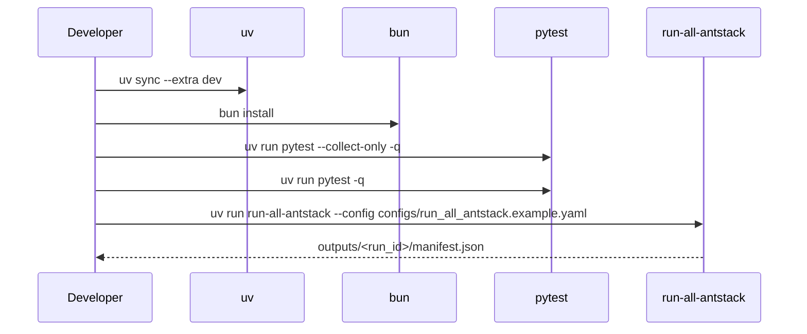

# Getting Started

Use this guide to set up the repository, validate the environment, and generate the first canonical Ant Stack outputs.



## Prerequisites

- Python 3.10 or newer
- `uv`
- `bun`
- Optional for full paper rendering: `pandoc` and a XeLaTeX-capable TeX installation

## Setup

```bash
uv sync --extra dev
bun install
```

Verify imports and command registration:

```bash
uv run python -c "import antstack_core; print(antstack_core.__version__)"
uv run antstack-build --validate-only
uv run run-all-antstack --config configs/run_all_antstack.example.yaml --validate-only
```

## First Run

Run the test suite:

```bash
uv run pytest --collect-only -q
uv run pytest -q
```

Generate canonical artifacts:

```bash
uv run run-all-antstack --config configs/run_all_antstack.example.yaml
```

The default config writes to `outputs/example-run/` and includes data, statistics, static figures, GIF/HTML animations, Markdown reports, paper-ready projections, logs, manifests, and provenance.

## Paper Workflow

Regenerate complexity energetics compatibility outputs:

```bash
uv run antstack-ce papers/complexity_energetics/manifest.example.yaml --out papers/complexity_energetics/out
```

Validate all paper configs:

```bash
uv run antstack-build --validate-only
```

Build PDFs only when Pandoc and LaTeX are installed:

```bash
uv run antstack-build
```
