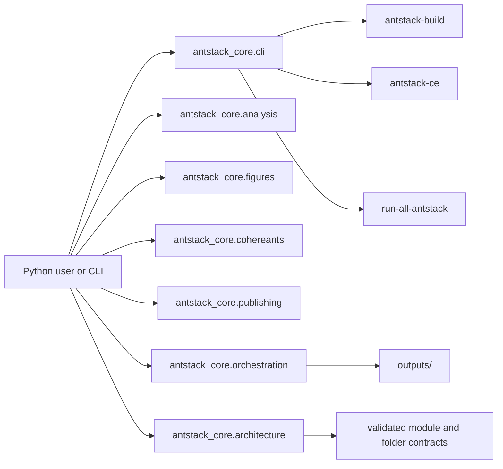

# Public API Contracts

This page records the intended public surface for real, composable, tested, and documented Ant Stack methods. Treat `__all__` exports as the discoverable contract; anything outside those exports is implementation detail unless a local README says otherwise.



## Contract Rules

- Public methods accept in-memory Python, NumPy, Pandas, or dataclass values where practical.
- File and CLI wrappers stay thin and delegate to package-owned APIs or the paper runner.
- Invalid inputs raise explicit exceptions instead of silently fabricating results.
- Generated figures, tables, and manuscript fragments must have a documented regeneration command in the nearest README.
- Public exports are checked by `tests/antstack_core/test_public_contracts.py`.
- CLI wrappers are checked by `tests/antstack_core/test_cli_entrypoints.py`.
- Folder signposting is checked by `tools/ensure_folder_docs.py --check` and `tests/antstack_core/test_docs_contract.py`.

## Package Modules

| Module | Public responsibility | Focused validation |
| --- | --- | --- |
| `antstack_core.analysis` | Energy coefficients, compute loads, workloads, statistics, experiment manifests, key numbers, power meters, empirical reporting, and theoretical limits. | `uv run pytest -q tests/antstack_core/test_analysis_energy.py tests/antstack_core/test_analysis_statistics.py tests/antstack_core/test_statistical_analysis.py tests/antstack_core/test_experiment_config.py` |
| `antstack_core.cohereants` | Physical conversions, spectroscopy, CHC analysis, behavioral datasets, statistics, power analysis, and plots. | `uv run pytest -q tests/antstack_core/test_cohereants_core.py tests/antstack_core/test_spectroscopy.py tests/antstack_core/test_cohereants_behavioral.py` |
| `antstack_core.figures` | Matplotlib plots, publication figures, Mermaid preprocessing, cross-reference checks, and asset organization. | `uv run pytest -q tests/antstack_core/test_figures_plots.py tests/antstack_core/test_visualization.py` |
| `antstack_core.publishing` | PDF generation, templates, quality validation, reference health, build orchestration, and provenance helpers. | `uv run antstack-build --validate-only` |
| `antstack_core.orchestration` | Run-all config validation, output layout creation, checksummed manifests, canonical outputs, compatibility projection, logs, and provenance. | `uv run pytest -q tests/antstack_core/test_run_all_antstack.py` |
| `antstack_core.architecture` | Executable module/folder contracts, public export validation, layer indexing, and Mermaid architecture rendering. | `uv run pytest -q tests/antstack_core/test_architecture_contract.py` |
| `antstack_core.mathematics` | Publishing-safe math normalization and LaTeX label extraction. | `uv run pytest -q tests/antstack_core/test_core_package.py` |

## CLI Entrypoints

| Command | Purpose |
| --- | --- |
| `uv run antstack-build --validate-only` | Validate paper build readiness without writing PDFs. |
| `uv run antstack-ce papers/complexity_energetics/manifest.example.yaml --out papers/complexity_energetics/out` | Regenerate compatibility complexity energetics outputs. |
| `uv run run-all-antstack --config configs/run_all_antstack.example.yaml` | Generate canonical data, statistics, visualizations, animations, reports, paper projections, logs, manifests, and provenance under `outputs/<run_id>/`. |

## Contract Validation

```bash
uv run pytest -q tests/antstack_core/test_public_contracts.py
uv run pytest -q tests/antstack_core/test_architecture_contract.py
uv run pytest -q tests/antstack_core/test_cli_entrypoints.py
uv run pytest -q tests/antstack_core/test_docs_contract.py
uv run run-all-antstack --config configs/run_all_antstack.example.yaml --validate-only
```
