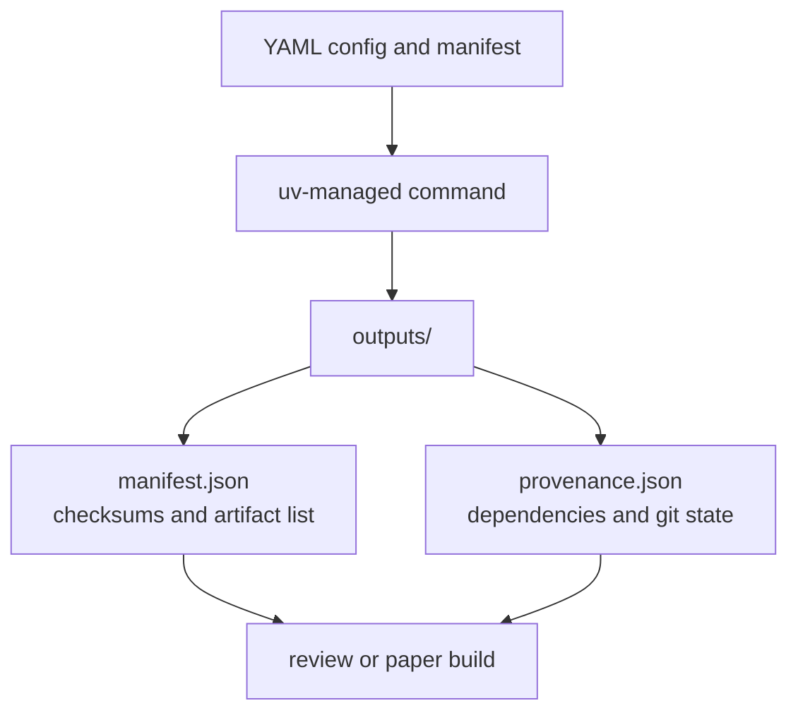

# Reproducibility

Ant Stack reproducibility depends on deterministic configuration, dependency-managed commands, versioned intentional artifacts, and explicit provenance.



## Rules

- Use `uv run` for Python commands and `bun run` for package scripts.
- Use `configs/run_all_antstack.example.yaml` as the canonical run-all example.
- Use `ExperimentManifest` files for scientific workload parameters.
- Keep intentional generated artifacts only when they have documented regeneration commands.
- Remove bytecode, caches, OS metadata, virtual environments, and transient test output from tracked state.

## Canonical Output Provenance

`run-all-antstack` writes:

- `outputs/<run_id>/manifest.json`
- `outputs/<run_id>/provenance/provenance.json`
- `outputs/<run_id>/provenance/dependency_versions.json`
- `outputs/<run_id>/provenance/git_state.json`
- `outputs/<run_id>/provenance/output_inventory.json`

## Reproducibility Commands

```bash
uv sync --extra dev
bun install
uv run pytest -q
uv run run-all-antstack --config configs/run_all_antstack.example.yaml
```
