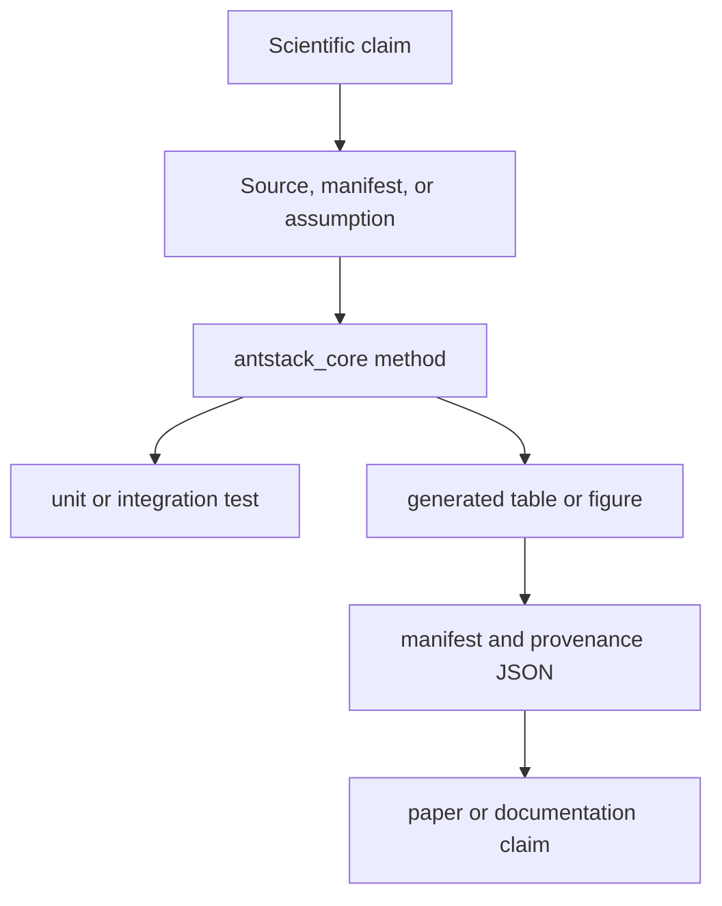

# Scientific Validation

Scientific validation checks whether numerical claims, generated figures, and manuscript fragments are traceable to configured methods, source data, and reproducible commands.



## Validation Categories

- Statistical validity: bootstrap intervals, effect sizes, scaling fits, and power analysis should be computed by package methods.
- Physical validity: energy, workload, and complexity outputs should respect configured units and parameter bounds.
- Empirical validity: external ant datasets must follow [external_ant_data_integration.md](external_ant_data_integration.md).
- Reproducibility: generated outputs must include command, input, dependency, git-state, and checksum provenance when produced by `run-all-antstack`.

## Required Practices

- Keep scientific workload parameters in `ExperimentManifest` files.
- Cite or soften claims that are not directly supported by local outputs or external sources.
- Prefer deterministic closed-form workload modes for CI and documentation examples.
- Store canonical generated artifacts under `outputs/<run_id>/` and paper compatibility artifacts under documented paper-local roots.

## Validation Commands

```bash
uv run pytest -q tests/antstack_core/test_analysis_statistics.py tests/antstack_core/test_statistical_analysis.py
uv run antstack-ce papers/complexity_energetics/manifest.example.yaml --out papers/complexity_energetics/out
uv run run-all-antstack --config configs/run_all_antstack.example.yaml
```
