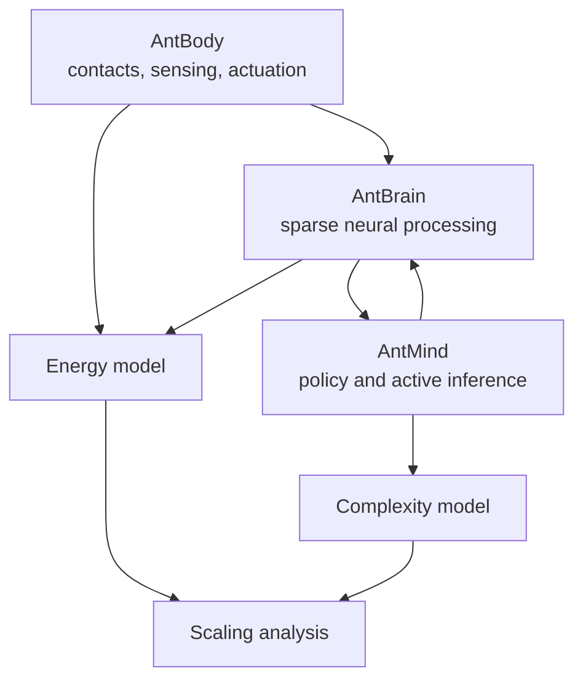

# Theory

Ant Stack organizes embodied intelligence into body, brain, and mind layers, then studies how computational and physical energy scale across those layers.

## Conceptual Layers

- AntBody: physical contacts, sensors, actuation, and mechanical energy.
- AntBrain: sparse sensory processing, Kenyon-cell style population models, and neural compute.
- AntMind: policy evaluation, planning horizon, and active-inference style symbolic computation.

## Energy And Complexity

- Compute energy is estimated from FLOPs, SRAM bytes, DRAM bytes, spikes, and baseline power.
- Body energy includes mechanical and sensing contributions.
- Mind energy is treated according to the complexity energetics manifest conventions and may be symbolic in paper accounting.
- Scaling analyses should be generated from configured parameter sweeps, not hand-maintained numbers.

## Source Of Truth

- Package methods: `antstack_core.analysis`
- Experiment configuration: `papers/complexity_energetics/manifest.example.yaml`
- Canonical generated outputs: `outputs/<run_id>/statistics` and `outputs/<run_id>/visualizations`
