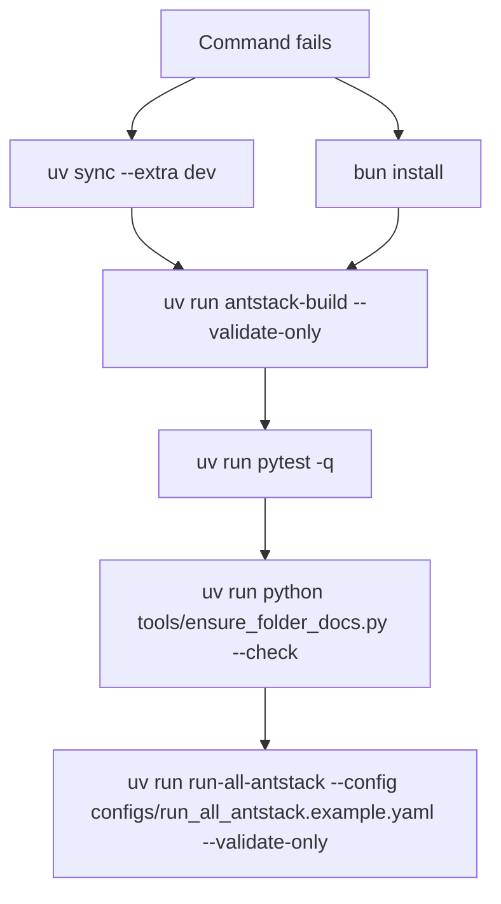

# Troubleshooting

Use this guide to diagnose command, dependency, rendering, and output issues in the current `uv + bun` workflow.



## Command Not Found

Run:

```bash
uv sync --extra dev
uv run python -c "import antstack_core; print(antstack_core.__version__)"
```

Then retry installed commands:

```bash
uv run antstack-build --validate-only
uv run antstack-ce papers/complexity_energetics/manifest.example.yaml --out papers/complexity_energetics/out
uv run run-all-antstack --config configs/run_all_antstack.example.yaml --validate-only
```

## Mermaid Or Paper Rendering Fails

Run:

```bash
bun install
uv run antstack-build --validate-only
```

Full PDF builds additionally require Pandoc and a XeLaTeX-capable TeX installation.

## Tests Fail

Start with collection:

```bash
uv run pytest --collect-only -q
uv run pytest -q
```

Run focused tests for the changed subsystem before the full suite.

## Output Or Provenance Missing

Validate the run-all config first:

```bash
uv run run-all-antstack --config configs/run_all_antstack.example.yaml --validate-only
```

Then generate artifacts:

```bash
uv run run-all-antstack --config configs/run_all_antstack.example.yaml
```

Check `outputs/<run_id>/manifest.json` and `outputs/<run_id>/provenance/`.
