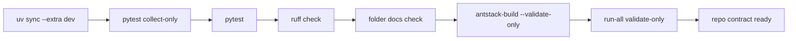

# Validation Framework

Validation in Ant Stack is command-backed. Documentation should describe commands that work in the current `uv` environment and should distinguish validation from artifact generation.



## Required Gates

```bash
uv sync --extra dev
bun install
uv run pytest --collect-only -q
uv run pytest -q
uv run ruff check .
uv run python tools/ensure_folder_docs.py --check
uv run antstack-build --validate-only
uv run run-all-antstack --config configs/run_all_antstack.example.yaml --validate-only
```

## Side Effects Of Validation Commands

- `uv run run-all-antstack ... --validate-only` parses and validates the config and writes nothing (verified against `antstack_core/orchestration/run_all.py`, which returns before run-layout creation).
- `uv run antstack-build --validate-only` validates paper configs and environments but still regenerates the timestamped root `build_report.md`; it does not build PDFs or write paper artifacts.

## Acceptance Criteria

- Tests collect without import or duplicate-file errors.
- The default suite passes without skipped tests or runtime-warning summaries.
- Ruff reports no lint errors under the configured rule set.
- Every intentional directory has `README.md` and `AGENTS.md`.
- Paper validation succeeds without requiring PDF generation.
- Run-all config validation succeeds before any run artifacts are created.

## Artifact-Producing Checks

Use these when validating generation paths rather than just readiness:

```bash
uv run antstack-ce papers/complexity_energetics/manifest.example.yaml --out papers/complexity_energetics/out
uv run run-all-antstack --config configs/run_all_antstack.example.yaml
```
