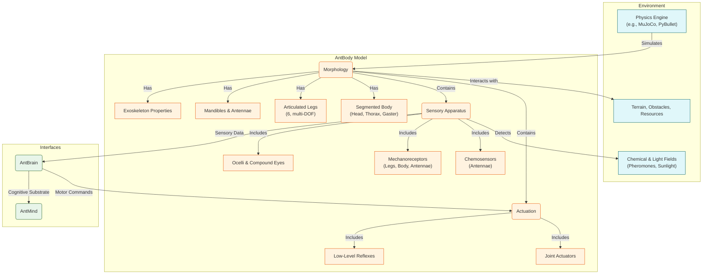

# AntBody

`AntBody` is a physics-based model of ant morphology, biomechanics, and sensors. It adapts the `FlyBody` MuJoCo simulator to ant-specific leg kinematics, exoskeletal properties, and antennae/mandible actuation (portable to PyBullet). It emits the raw sensorimotor stream to `AntBrain` and executes motor commands. The objective is not photorealism but functional fidelity: reproduce contact dynamics, gradient sensing, and actuation latencies that pose the same control problems real ants solve.

## Morphology and Biomechanics

- **Segmented body:** Head, thorax, gaster with articulated joints.
- **Six articulated legs:** Multiple degrees of freedom (DOF) per leg for tripod gait and uneven terrain.
- **Mandibles and antennae:** Grasping/manipulation; near-field chemosensation.
- **Exoskeleton properties:** Rigidity and mass distribution for realistic contact.
- **Thermoregulation & hydration:** Optional environmental coupling for temperature and humidity tolerance experiments.

## Actuation and Motor Control

- **Joint actuators:** Muscle-like force generation per joint.
- **Low-level control:** Reflexive stabilization (e.g., stance) beneath `AntBrain` commands; optionally PID/impedance at joints for robust terrain contact.

## Sensory Apparatus

- **Chemosensors:** Antennal channels detect pheromone gradients and absolute concentration.
- **Mechanoreceptors:** Leg/body/antennal contact, forces, joint angles/velocities.
- **Ocelli/compound eyes:** Ambient luminance, polarized-light compass, low-res motion/landmarks.
- **Auditory/vibration (optional):** Substrate-borne vibration sensing for alarm/communication experiments.

Goal: a functionally accurate ant nestmate body posing the same control problems a real ant brain evolved to solve.

## Interfaces (I/O Contract)

- **Observation o_t ($100\,\mathrm{Hz}$; SI units unless noted):**
  - Chemosensors: K channels/antenna, normalized [0,1]; gradient and absolute concentration
  - Mechanoreceptors: per-leg contact (bool), ground reaction forces (N), joint angles (rad), joint velocities (rad/s)
  - Vision: ocelli luminance (normalized), optional optic flow (px/s), polarized-light compass (deg)
  - IMU (optional): linear acceleration (m/s^2), angular velocity (rad/s)
- **Action a_t ($100\,\mathrm{Hz}$):**
  - Joint targets: position (rad) or torque (N·m) per DOF (configurable)
  - Mandible aperture (rad), antennae joint targets (rad)
- **Timing:** Physics step $\Delta t = 1$ ms; control loop acts every 10 steps ($100\,\mathrm{Hz}$)
- **Latency budget:** End-to-end sensor$\to$actuator latency target $\le 20$ ms (configurable)
- **Synchronization:** Monotonic timebase; max drift between body and brain clocks $\le 2$ ms; timestamp every observation

Strict units and update rates enable drop-in replacement of bodies and simplify benchmarking across engines.

## Configuration

- Dynamics: position or torque control
- Terrain: flat, rough, slope
- Sensor noise: Gaussian $\sigma$ per channel
- Pheromone field: on/off, diffusion $D$, decay $\lambda$
- Energy model (optional): per-actuator energy and baseline metabolism for efficiency metrics
- Contact/friction: Coulomb friction coefficients ($\mu_s, \mu_k$) and restitution per material
- Sensor/actuator calibration: per-channel offset/gain with auto-calibration routines and logs
- Batch mode: offline rollout/export of o_t, a_t, and internal state for dataset generation

Recommended defaults: 3--4 DOF/leg, $\Delta t = 1$ ms, $100\,\mathrm{Hz}$ control, Gaussian sensor noise $\sigma \in [0.01, 0.05]$.

### Section Summary

- Concrete physics/sensing substrate with explicit I/O rates and units
- Built-in stabilization simplifies higher-level policies and improves robustness
- Parameterized terrain, control, noise, and stigmergy for reproducible experiments

## Further Technical Notes and References

- **Dynamics and Engines**
  - Typical stable physics step: $\Delta t \approx 1$ ms (1 kHz) with a $100\,\mathrm{Hz}$ control loop, as used in MuJoCo and similar engines.
  - Engines: MuJoCo ([site](\href{https://mujoco.org/}{MuJoCo Physics Engine}); Todorov et al., IROS 2012: [IEEE Explore](\href{https://ieeexplore.ieee.org/}{IEEE Xplore}document/6386109)), PyBullet ([site](https://pybullet.org/wordpress/)).
- **Leg Kinematics and Gaits**
  - Practical hexapod configurations use 3--4 DOF per leg (e.g., hip yaw/pitch, knee, optional ankle) to reproduce tripod gaits and turning.
  - Tripod gait overview and insect walking control: Cruse (1990) review ([Springer](https://link.springer.com/article/10.1007/BF00696943)) and summary ([Wikipedia](https://en.wikipedia.org/wiki/Tripod_gait)).
- **Sensors**
  - Polarization compass via ocelli/sky light: Wehner (2003) annual review on desert ant navigation ([Annual Reviews](https://www.annualreviews.org/doi/10.1146/annurev.ento.48.091801.112645)).
  - Optic flow and landmark guidance in insects: Seelig & Jayaraman (2015) for orientation integration ([Nature](https://www.nature.com/articles/nature14581)).
- **Pheromone Field (Environment Model)**
  - Diffusion--decay dynamics follow Fick’s law with evaporation; see Fick’s laws ([Wikipedia](https://en.wikipedia.org/wiki/Fick%27s_laws_of_diffusion)) and ant colony trail models ([Wikipedia](https://en.wikipedia.org/wiki/Ant_colony_optimization_algorithms)).
  - Contact modeling: Coulomb friction and restitution parameterization; terrain moisture can modulate slip
