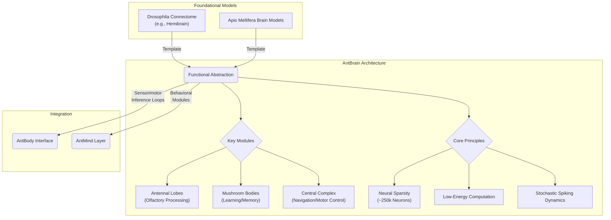

# AntBrain

`AntBrain` is a functional abstraction of an ant's neural architecture. It models key circuits and principles sufficient for adaptive behavior, initially at the circuit level and eventually at the cellular (neuron and glia) and synaptic level.

The architecture is templated from mapped insect brains (e.g., *Drosophila* hemibrain; *Apis* models) to remain biologically plausible and computationally tractable. Future ant-specific neuroanatomy can be mapped onto this template. Where available, species-level differences (e.g., glomerular counts, CX architecture) parameterize modules.

## Scope and Assumptions

- Functional, not synapse-accurate; modules align to conserved circuits (AL, MB, CX)
- Sparse, low-power operation at $100\,\mathrm{Hz}$ closed loop; ~1e5--2.5e5 neurons (configurable)
- Local learning (e.g., STDP) with simple modulatory signals; no global backprop
- Noise is a feature: stochasticity aids exploration and regularization; parameters expose variance at module boundaries

## Template Resource: Virtual Fly Brain (VFB)

[Virtual Fly Brain (About)](https://www.virtualflybrain.org/about/) is an interactive resource for exploring the neuroanatomy, neuron connectivity, and gene expression of Drosophila melanogaster. It integrates curated literature and image datasets onto a common brain template, enabling cross-search, similarity queries, and 3D comparison of neurons and regions.

We use VFB to align region nomenclature, ground functional abstractions of AL/MB/CX in mapped fly circuits, and inform parameters where ant-specific data are sparse. Where ant data exist, we override defaults via species presets.

## Design Principles

### 1. Functional Emulation

Simulate functional roles of key structures rather than replicate every neuron. Favor minimal sufficient mechanisms with measurable interfaces.

### 2. Neural Sparsity and Efficiency

- **Neuron count:** ~250k target; biologically plausible and tractable
- **Optimization:** Low-energy computation and sparse representations
- **Dynamics:** Stochastic spiking and local learning (Hebbian, STDP)
- **Neuromodulation:** Reward/aversive signals (dopamine, octopamine, other biogenic amines) gate plasticity and policy bias
  with per-task schedules exported for reproducibility

### 3. Integration

- **Sensorimotor loops:** Tight closed loop with `AntBody`
- **Behavioral modules:** Substrate for higher-level programs orchestrated by `AntMind`
- **Multi-modal fusion:** AL/MB olfaction with visual/vestibular cues into CX heading and action channels
  with explicit timing constraints to maintain closed-loop stability at $100\,\mathrm{Hz}$

## Implementation Notes

- Engine: spiking (Brian2 / Nengo / SpikingJelly) or hybrid rate-based
- I/O: map `AntBody` observations to AL$\to$MB$\to$CX; policy head drives CX motor channel
- Interfaces are stable and testable: each module exposes a minimal API with typed tensors and unit metadata.
- **Cross-module timing:** AL/MB update at $100\,\mathrm{Hz}$; CX policy head 50--$100\,\mathrm{Hz}$ depending on task
- Learning:
  - MB: sparse coding (Kenyon cells); local plasticity with reward/punishment gating
  - CX: ring-attractor heading; soft WTA for action selection
- Targets: neurons ~1e5--2.5e5; sparse activity; $100\,\mathrm{Hz}$ closed-loop
- **Memory:** short-term eligibility traces; long-term synaptic consolidation checkpoints for reproducibility; model cards documenting learning rules and seeds
 - Neuromodulation API: dopamine/octopamine gating channels exposed via a minimal interface for reproducible learning schedules
 - Footprint reporting: track neuron counts, parameter sizes, and update rates per module

### Technical Pointers and References

- **Antennal Lobe (AL):** Glomerular combinatorial codes and projection neuron mapping from ORNs; review in Wilson (2013) ([Annual Reviews](https://www.annualreviews.org/doi/10.1146/annurev-neuro-062111-150525)).
- **Mushroom Bodies (MB):** Sparse coding via Kenyon cells and associative plasticity; Caron et al. (2013) ([Science](https://www.science.org/doi/10.1126/science.1235452)).
- **Central Complex (CX):** Ring attractor for heading; Seelig & Jayaraman (2015) ([Nature](https://www.nature.com/articles/nature14581)).
- **Efficient Spiking Simulation:** Brian2 ([docs](https://brian2.readthedocs.io/)), Nengo ([site](https://www.nengo.ai/)), SpikingJelly ([GitHub](https://github.com/fangwei123456/spikingjelly)).
- **Virtual Fly Brain (VFB):** Structural templates and nomenclature ([about](https://www.virtualflybrain.org/about/)).

These resources ground the AL$\to$MB$\to$CX pipeline and support sparse, energy-efficient implementations suitable for $100\,\mathrm{Hz}$ closed-loop control.

## Key Neural Circuits and Their Functions

While a full connectome is absent, we can model the primary functions of key, conserved insect brain regions.

- **Antennal Lobes (AL):** This is the first-order olfactory processing center. It receives input from chemosensors on the antennae and organizes odor information into a combinatorial code. Different odors evoke unique patterns of glomerular activation, forming a "scent signature" that is passed to higher brain centers.
- **Mushroom Bodies (MB):** The MB is a critical center for associative learning and memory, homologous to the hippocampus in vertebrates. It receives processed olfactory information from the AL and integrates it with other sensory modalities and internal state information. Its sparse coding scheme, enforced by a large number of Kenyon cells, is ideal for forming and storing specific memories, such as linking an odor to a food reward or a threat.
- **Central Complex (CX):** This is a highly-structured region crucial for spatial navigation, goal-directed behavior, and action selection. It integrates sensory cues (especially visual information like polarized light for sky-compass navigation) to maintain a representation of the ant's heading and orientation relative to its environment. It plays a key role in translating high-level goals (e.g., "return to the nest") into specific directional motor commands.

### Selected References

- See `Resources.md` for core literature on insect brain organization and active inference, and for datasets/tools (e.g., VFB) used to template modules.

### Section Summary

- Compact, biologically grounded AL$\to$MB$\to$CX control stack with sparse coding and local plasticity
- Tight interfaces with `AntBody` (sensorimotor) and `AntMind` (policy/context)
- Efficiency and configurability prioritized over full connectomic fidelity
