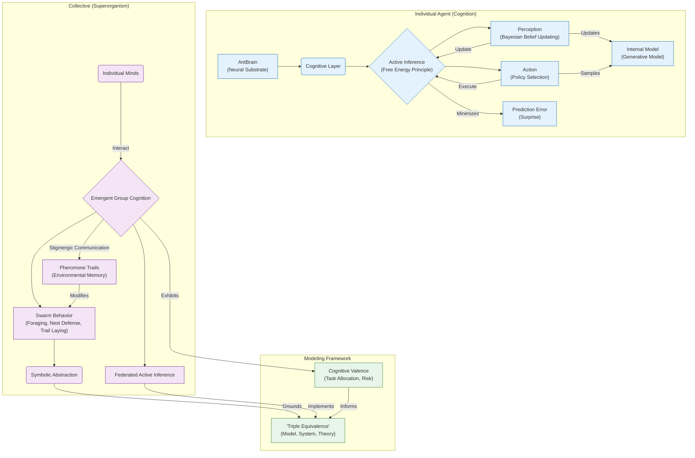

# AntMind

`AntMind` is the cognitive layer bridging `AntBrain` with symbolic abstraction and collective intelligence. It specifies how individual agents decide and how those decisions compose into colony-level intelligence. The focus is on minimal, testable machinery that scales from one agent to many without changing local rules.

## Scope and Assumptions

- Active Inference links perception and action via a compact generative model
- Symbolic abstraction emerges from grounded sensorimotor predictions
- Colony cognition uses stigmergy and sparse sharing; no centralized controller
- Policies are small: short horizons ($\le 2$ s), low channel counts, and local updates favor transparency and transfer

## Key Concepts

### Individual Cognition: Active Inference

- **Predictive processing:** Perception updates a generative model to reduce prediction error
- **Free Energy Principle:** Actions minimize expected free energy over time
- **Symbolic grounding:** Symbols emerge from sensorimotor predictions (supports the “triple equivalence”)
- **Risk sensitivity:** Preferences encode risk/ambiguity attitudes; policy selection trades off exploration vs exploitation

### Collective Intelligence: Emergence via Stigmergy

- **Stigmergy:** Environmental traces (pheromones) coordinate behavior; the trail is the memory
- **Distributed cognition:** Memory, decision-making, and learning are shared across agents and environment
- **Low-footprint:** ~250k neurons/agent with simple rules yield rich emergent intelligence
- **Resilience:** Redundant environmental memory (pheromones) and local priors improve recovery from deception

### From Sub-symbolic to Symbolic Cognition

The stack offers a pathway from sub-symbolic processing to symbolic reasoning via grounded predictions. Symbols are treated as compressed, re-usable predictions tied to tasks and sensory contexts.

## Minimal Generative Model (Single Agent)

- Latent state s_t: pose, heading, internal drive (hunger), local pheromone expectation
- Observation o_t: from `AntBody` I/O
- Action a_t: joint targets
- Preferences: priors over outcomes (food proximity↑, energy cost↓, collision↓)
- Constraints: energy budget and temperature/humidity limits (optional) shape expected free energy
- Update: variational free energy minimization (amortized); policy selection over 0.5--2.0 s
- Rates: control $100\,\mathrm{Hz}$; policy update $10\,\mathrm{Hz}$
- Diagnostics: report expected free energy terms (risk, ambiguity), action entropy, and policy dwell time
 - Diagnostics: report EFE decomposition (epistemic/pragmatic value), action entropy, policy dwell time, and constraint violations

## Pheromone Field (Stigmergy)

- Grid $c_t(x)$: $c_{t+1} = (1-\lambda)\,c_t + D\,\nabla^2 c_t + \sum \text{deposits}$
- Parameters: $\lambda$ decay, $D$ diffusion; deposits increase on reward return
- Agents follow $\nabla$c; following probability rises with |$\nabla$c|
- Interfaces: deposit/read operations are unit-aware; decay and diffusion are version-pinned for replication
 - Stability: saturation/clipping on c_t and deposit rates to prevent runaway trails; optional anisotropic diffusion under wind

### Technical Pointers and References

- **Active Inference (Foundations):** Various primers and tutorials ([Nature Neuroscience](https://www.nature.com/articles/nn.4137), [Frontiers in Human Neuroscience](https://www.frontiersin.org/articles/10.3389/fnhum.2017.00499/full), [Active Inference Institute resources](https://welcome.activeinference.institute/)).
- **Active Inference in Ants:** ActiveInferAnts simulation and paper (Frontiers 2021) ([Frontiers in Behavioral Neuroscience](https://www.frontiersin.org/articles/10.3389/fnbeh.2021.647732/full), [ActiveInferAnts](https://github.com/ActiveInferenceInstitute/ActiveInferAnts)).
- **Population-Based/Swarm AIF:** Recent applications to swarm intelligence and search ([arXiv](https://arxiv.org/abs/2408.09548)).
- **Stigmergy and Ant Trails:** Canonical formulations in ant optimization and diffusion-decay fields ([Ant colony optimization](https://en.wikipedia.org/wiki/Ant_colony_optimization_algorithms), [Fick’s laws of diffusion](https://en.wikipedia.org/wiki/Fick%27s_laws_of_diffusion)).

## Colony-Level Arbitration

- Federated active inference: local beliefs shared sparsely via stigmergy; no central controller
- Task allocation: soft constraints via internal drives and pheromone-mediated opportunities
- Safety: monitor for deceptive gradients; trigger re-exploration and attenuate deposit under conflict
 - Belief sharing: lossy compression of shared statistics (e.g., recent reward rates, local gradient summaries)

### Section Summary

- Cognitive bridge from neural substrate to behavior and collective intelligence
- Minimal, testable generative model with explicit stigmergy dynamics
- Small-footprint policies that compose across agents
