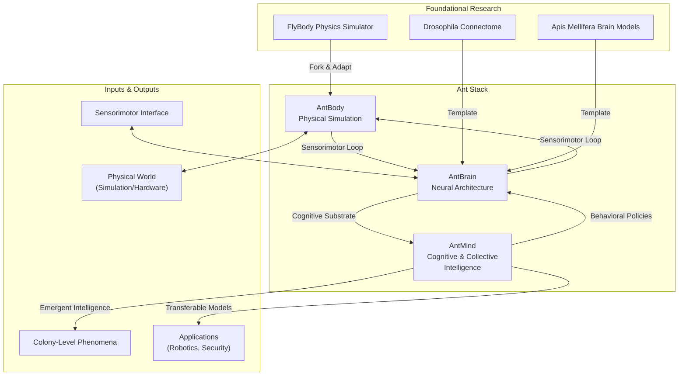

# The Ant Stack

The Ant Stack is a compact, modular framework for simulating an ant agent---body, brain, and mind---to study how robust intelligence emerges from sensorimotor grounding and collective interaction. It emphasizes biologically plausible interfaces, sparse/low-power computation, and clear I/O contracts. The aim is pragmatic: a small, interoperable stack that is easy to test, extend, and transfer to real systems.

The framework is composed of three primary layers: `AntBody`, `AntBrain`, and `AntMind`. This structure allows for a separation of concerns, where physical simulation, neural architecture, and cognitive modeling can be developed and studied independently while remaining interoperable. The goal is to build upon foundational research in other insects, such as *Drosophila* and *Apis*, to accelerate the development of a sophisticated ant model with wide-ranging applications.

## Roadmap & Contributions

- Implement `AntBody` I/O contract; `AntBrain` AL$\to$MB$\to$CX with sparse learning; `AntMind` minimal generative model and stigmergy field; evaluation benchmarks and baseline species presets
- Ship species parameter presets and experiment manifests (YAML/JSON) for one-click reruns
- Contributions welcome via pull requests. Keep edits small; include seeds, units, and benchmarks. Propose task variants aligned with the evaluation suite.

## Ant Stack Summary

Compact agents with realistic bodies, efficient brains, and principled minds provide a tractable route to study intelligence-as-compression and alignment in multi-agent settings. The Ant Stack offers a minimal, testable path from physics to collective behavior with explicit interfaces and benchmarks.
