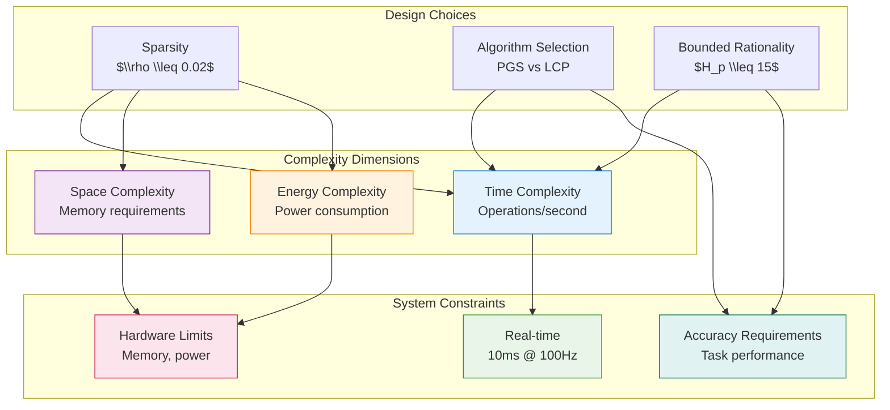

# Complexity Analysis

## Theoretical Framework and Real-Time Design Principles

Here we present a comprehensive complexity analysis framework that bridges theoretical asymptotic bounds with practical real-time implementation constraints. Unlike theoretical computer science approaches that focus primarily on asymptotic behavior in infinite-compute settings, our framework provides practical guidance for system designers working under strict timing and energy constraints.

This framework explicitly addresses the real-time constraints inherent in embodied AI systems. Our focus is to analyze the Ant Stack's complexity and energy characteristics, integrating algorithmic complexity analysis with energy modeling and scaling relationship analysis.

### Complexity Analysis Overview

Our analysis evaluates algorithmic complexity across three key dimensions: **Time Complexity** (operations per decision cycle, must fit within 10 ms at 100 Hz), **Space Complexity** (memory requirements for data structures and intermediate computations), and **Energy Complexity** (energy consumption implications of computational choices).

### Computational Complexity Theory Foundations

Our analysis extends beyond traditional Big-O notation to incorporate parameterized complexity theory, which provides more nuanced characterization of algorithmic behavior. For embodied systems, we distinguish between:

**Fixed-Parameter Tractable (FPT) Problems**: Where exponential complexity is confined to specific parameters (e.g., contact count $C$ in contact dynamics), enabling efficient solutions for realistic parameter ranges.

**Parameterized Complexity Classes**: Body contact dynamics: $\mathcal{O}(C^{1.5})$ with $C \leq 20$ in practice (PGS solver), and Brain neural processing: $\mathcal{O}(\rho N_{KC})$ with $\rho \leq 0.02$ (biological sparsity)

**Practical Implications**: The FPT classification enables us to design algorithms that are efficient for realistic parameter ranges while maintaining theoretical rigor. This approach is particularly valuable for embodied systems where certain parameters (like contact count or neural sparsity) are naturally bounded by physical constraints.

**Complexity Hierarchies**: We establish complexity hierarchies within each module: **AntBody** ($\mathcal{O}(J) \subset \mathcal{O}(C^{1.5}) \subset \mathcal{O}(C^3)$, increasing complexity with solver accuracy), **AntBrain** ($\mathcal{O}(K) \subset \mathcal{O}(\rho N_{KC}) \subset \mathcal{O}(N_{KC})$, sparsity enables scalability), and **AntMind** ($\mathcal{O}(B H_p) \subset \mathcal{O}(B^{H_p})$, bounded rationality vs exact inference).

### Real-Time Computational Constraints

**Decision Cycle Timing Requirements**: At $100\,\mathrm{Hz}$ operation, each computational cycle must complete within 10 ms, creating hard real-time constraints that determine system feasibility. This timing requirement transforms theoretical complexity bounds into practical design criteria.

**Algorithm Selection Criteria**: Real-time constraints require evaluating algorithms by their practical performance within timing budgets. This evaluation must consider constant factors, memory access patterns, and implementation-specific optimizations beyond simple asymptotic analysis.

### Sparsity as Fundamental Design Principle

**Computational Tractability Through Sparsity**: Sparsity patterns emerge as the primary mechanism for maintaining computational feasibility as system parameters scale. Key sparsity constraints include neural connectivity $\rho \leq 0.02$ (biological sparsity), contact sets $C \leq 20$ (terrain-dependent active contacts), and policy spaces $H_p \leq 15$ (planning horizon limits).

**Multi-Scale Sparsity Implementation**: Effective sparsity requires coordinated implementation across neural, physical, and cognitive domains, creating interconnected sparsity patterns that collectively enable system scalability while maintaining functional fidelity.

### Complexity-Performance Trade-offs

The following figure illustrates the key complexity-performance trade-offs in embodied AI systems:

**Figure: Complexity Trade-offs in Embodied AI** {#fig:complexity_tradeoffs}



**Caption:** Complexity-performance trade-offs in embodied AI systems. Sparsity, algorithm selection, and bounded rationality represent key design levers for balancing computational complexity with system constraints and performance requirements.

## System Parameter Framework

### Morphological Parameters (AntBody)

**Joint Degrees of Freedom ($J$)**: Total actuated joints in the robotic platform

- Hexapod range: 18-24 joints (6 legs $\times$ 3 joints each: coxa, femur, tibia)

- Complexity impact: $\mathcal{O}(J)$ for forward dynamics, $J \cdot 25$ FLOPs per joint

- Design trade-off: Additional joints improve locomotion dexterity but increase computational load

**Active Contact Points ($C$)**: Ground contact constraints per decision cycle

- Terrain-dependent range: 6-20 active contacts

- Complexity scaling: $\mathcal{O}(C^{1.5-3})$ depending on solver selection

- Critical threshold: $C > 20$ contacts triggers exponential complexity growth

**Sensor Channels ($S$)**: Multi-modal sensory input streams

- Comprehensive range: 100-1000 channels (IMU, vision, chemosensors, tactile)

- Processing complexity: $\mathcal{O}(S)$ base cost, $\mathcal{O}(S^2)$ for correlation analysis

- Memory requirements: $S \cdot 16$ bytes base storage, $S^2 \cdot 4$ bytes for fusion matrices

**Visual Processing ($P$)**: Optic flow computation pixels

- Resolution range: $64 \times 64$ to $256 \times 256$ pixels

- Computational cost: $\mathcal{O}(P)$ with $P \cdot 15$ FLOPs for pyramid-based flow estimation

### Neural Architecture Parameters (AntBrain)

**Antennal Lobe Inputs ($K$)**: Sensory feature channels to Mushroom Body

- Modality-dependent range: 64-512 input channels

- Processing complexity: $\mathcal{O}(K)$ with $K \cdot 15$ FLOPs for glomerular mapping

- Scaling behavior: Sub-linear energy growth enables massive sensory expansion

**Kenyon Cell Population ($N_{KC}$)**: Mushroom Body associative neurons

- Biological range: $10^4$-$10^5$ neurons following insect brain scaling

- Effective computation: $\mathcal{O}(\rho N_{KC})$ with sparsity constraint $\rho \leq 0.02$

- Memory footprint: $\mathcal{O}(N_{KC})$ base storage with sparse access patterns

**Neural Activity Fraction ($\rho$)**: Active neuron percentage in sparse coding

- Biological constraint: 0.01-0.05 range, with 0.02 as optimal balance

- Computational impact: Controls active synapses, spikes, and memory traffic

- Energy efficiency: Lower $\rho$ reduces computation but may impact capacity

**Heading Representation ($H$)**: Central Complex angular discretization

- Resolution range: 32-128 heading bins balancing precision and computation

- Complexity scaling: $\mathcal{O}(H)$ base cost, $\mathcal{O}(H^2)$ for lateral inhibition

- Memory usage: $H \cdot 4$ bytes for ring attractor state

### Cognitive Processing Parameters (AntMind)

**Policy Planning Horizon ($H_p$)**: Decision steps for active inference

- Tractability range: 1-20 steps (limited by exponential complexity)

- Critical threshold: $H_p > 15$ creates computational intractability

- Complexity scaling: $\mathcal{O}(B^{H_p})$ exponential growth, mitigated by bounded rationality

**Action Branching Factor ($B$)**: Available actions per decision step

- Behavioral range: 2-6 action choices (forward/back, turn, behavioral modes)

- Combinatorial impact: Multiplies policy space exponentially

- Design constraint: Small $B$ essential for computational feasibility

**Diagnostic Terms ($D$)**: Interpretability and monitoring outputs

- Analysis range: 5-15 diagnostic metrics for system monitoring

- Computational overhead: $\mathcal{O}(D)$ with minimal performance impact

- Memory cost: Negligible compared to policy evaluation

### Multi-Agent Coordination Parameters

**Pheromone Grid Resolution ($G$)**: Environmental discretization for stigmergy

- Spatial range: $10^4$-$10^6$ grid cells depending on environment scale

- Update complexity: $\mathcal{O}(G)$ for explicit diffusion-decay

- Memory requirements: $\mathcal{O}(G)$ primary storage bottleneck

**Active Agent Count ($A$)**: Concurrent autonomous entities

- Scaling analysis range: 1-100 agents for complexity characterization

- Interaction complexity: $\mathcal{O}(A)$ for local gradient reading

- Communication overhead: Event-driven pheromone deposits

**Deposit Events ($E$)**: Pheromone communication frequency

- Bounded by agents: $E \leq A$ per decision cycle

- Processing cost: $\mathcal{O}(E)$ for deposit operations

- Communication efficiency: Sparse event-driven updates

## AntBody Complexity Analysis

### Contact Dynamics and Physical Simulation

Our enhanced contact dynamics implementation provides solver-dependent complexity analysis with realistic performance characteristics for legged locomotion.

#### Contact Solver Algorithm Selection

**Projected Gauss-Seidel (PGS) - Real-Time Optimal**:
- **Complexity**: $\mathcal{O}(C^{1.5})$ with $C \cdot 50$ FLOPs per iteration
- **Iteration Count**: $\max(10, \sqrt{C} \cdot 5)$ condition-dependent convergence
- **Memory Usage**: $C \cdot 64$ bytes for contact state and constraint storage
- **Best Use Case**: $C \leq 20$ contacts, real-time legged locomotion
- **Performance**: Provides real-time feasibility with 1.5 power scaling

**Linear Complementarity Problem (LCP) - High Accuracy**:
- **Complexity**: $\mathcal{O}(C^3)$ for direct dense matrix factorization
- **Operations**: $C^3 \cdot 20$ FLOPs for full constraint matrix processing
- **Memory Usage**: $C^2 \cdot 8$ bytes for dense constraint matrices
- **Best Use Case**: Offline simulation requiring high numerical accuracy
- **Limitation**: Cubic scaling becomes prohibitive for $C > 10$

**Mixed LCP (MLCP) - Balanced Performance**:
- **Complexity**: $\mathcal{O}(C^{2.5})$ exploiting natural sparsity patterns
- **Sparsity Exploitation**: $\approx 30\%$ typical constraint matrix sparsity
- **Memory Optimization**: Reduced footprint through sparse matrix representations
- **Best Use Case**: $10 \leq C \leq 30$ contacts, balanced accuracy vs. speed

#### Forward Dynamics Integration

**Joint-Level Computation**: $\mathcal{O}(J)$ complexity with $J \cdot 25$ FLOPs per joint for enhanced physical realism including mass matrix computation and factorization, Coriolis and centrifugal force calculations, joint friction and backlash modeling, and actuator dynamics simulation.

**System-Level Integration**: Combined complexity $\mathcal{O}(J + C^{\alpha})$ where $\alpha \in [1.5, 3]$ depends on solver selection, with physics simulation at 1 kHz and control updates at $100\,\mathrm{Hz}$ creating multi-rate computational demands.

### Multi-Modal Sensor Processing

#### Sensor Data Acquisition Pipeline

**Base Sensor Processing**: $\mathcal{O}(S)$ complexity with $S \cdot 5$ FLOPs for analog-to-digital conversion and timestamping, data packing and memory organization, basic validation and range checking, and interrupt handling and DMA transfers.

**Advanced Sensor Fusion**: For $S > 100$ channels, additional $\mathcal{O}(S)$ cost with $S \cdot 2$ FLOPs for cross-modal correlation analysis, temporal filtering and noise reduction, sensor redundancy resolution, and confidence-weighted data fusion.

#### Memory Hierarchy Management

**SRAM-Resident Processing**: $S \cdot 16$ bytes for active sensor data in fast on-chip memory, **Correlation Matrices**: $S^2 \cdot 4$ bytes for pairwise sensor relationship modeling, and **DRAM Buffering**: $S \cdot 8$ bytes for large sensor arrays ($S > 512$) requiring external memory.

#### Specialized Sensory Processing

**Optic Flow Computation**: $\mathcal{O}(P)$ complexity with $P \cdot 15$ FLOPs for pyramid-based optical flow estimation, where $P$ ranges from $64 \times 64$ to $256 \times 256$ pixels for motion field computation.

**Polarized Light Navigation**: $\mathcal{O}(1)$ complexity with 20 FLOPs for heading computation from celestial polarization patterns, providing absolute orientation reference.

### Environmental Interaction and Stigmergy

#### Pheromone Field Computation

**Grid-Based Diffusion**: $\mathcal{O}(G)$ complexity for explicit Laplacian updates with stability constraint $\Delta t \leq h^2/(4D)$ requiring careful time step selection.

**Agent Deposit Operations**: $\mathcal{O}(E)$ with $E \leq A$ deposits per decision cycle, using sparse event-driven updates for computational efficiency.

**Gradient Reading**: $\mathcal{O}(A)$ for local pheromone field sampling with constant-radius stencils providing directional information for collective behavior.

#### Memory Requirements Summary

**State Storage**: $\mathcal{O}(J)$ for joint positions, velocities, and actuator states, **Contact Management**: $\mathcal{O}(C)$ for active constraint sets and solver workspaces, **Pheromone Grid**: $\mathcal{O}(G)$ for environmental state representation, and **Sensor Buffers**: $\mathcal{O}(S)$ for multi-modal sensory data streams.

## AntBrain (AL$\to$MB$\to$CX)

The AntBrain model incorporates biologically realistic sparse neural networks with configurable connectivity patterns:

### AL (Antennal Lobe)

**Enhanced input transform**: $\mathcal{O}(K)$ with $K \cdot 15$ FLOPs for realistic sensory processing including normalization and glomerular mapping, with $K \cdot 8$ bytes for input state and transformation matrices.

### MB (Mushroom Body)

Sparse coding with biological connectivity patterns (`calculate_sparse_neural_complexity`): **Random connectivity** ($N_{active} \cdot (20 + N_{total} \cdot \$\rho$ \cdot 2)$ FLOPs where $N_{active} = \$\rho$ \cdot N_{KC}$), **Small-world networks** ($1.5\times$ clustering factor increases local connectivity density), **Scale-free networks** (hub neurons 10% of population create $10\times$ higher connectivity), **Biological patterns** (local connections dominate 80% with $2\times$ density, sparse long-range 20% with $0.1\times$ density), **Spike generation** ($N_{active} \cdot 0.1$ spikes per decision, 10% firing rate typical for cortical neurons), and **Plasticity** ($N_{spikes} \cdot 5$ FLOPs for spike-dependent Hebbian learning).

### CX (Central Complex)

**Ring attractor dynamics**: $\mathcal{O}(H)$ with $H \cdot 12$ FLOPs plus lateral inhibition requiring $H^2 \cdot 0.5$ FLOPs, with $H \cdot 4$ bytes for heading state representation.

**Total brain complexity per tick**: $\mathcal{O}(K + \rho N_{KC} + H^2)$ with realistic constants. Event-driven implementations scale with actual spike counts, enabling significant energy savings during low-activity periods.

## AntMind (AIF policies, diagnostics)

The AntMind model (`enhanced_mind_workload_closed_form`) implements bounded rational active inference with realistic computational constraints:

### Policy Evaluation with Bounded Rationality

Active inference complexity (`calculate_active_inference_complexity`) incorporates **Policy tree enumeration** ($B^{H_p}$ total policies with exponential growth managed through sampling), **Belief update complexity** ($\text{state\_dim}^2 \cdot 10$ FLOPs per step for variational message passing), **Expected Free Energy (EFE)** ($(\text{state\_dim} + \text{action\_dim}) \cdot 15$ FLOPs per policy step), and **Precision optimization** ($\text{total\_policies} \cdot 3 \cdot 20$ FLOPs for attention/confidence calibration).

**Bounded rationality approximation**: For policy spaces $> 1000$, sampling limits effective policies to 1000 with $\text{total\_policies} \cdot 2$ FLOPs sampling overhead. This prevents exponential blowup while maintaining decision quality.

**Hierarchical processing**: Optional hierarchical mode increases complexity by $1.5\times$ FLOPs and $1.3\times$ memory for multi-level abstraction.

**Memory requirements**: $H_p \cdot (\text{state\_dim} \cdot 8 + \text{action\_dim} \cdot 4)$ bytes per policy, capped at 1000 policies for tractability.

**Total mind complexity**: $\mathcal{O}(B H_p \cdot \text{state\_dim}^2)$ with bounded rationality ensuring computational tractability. EFE diagnostics add $\mathcal{O}(D)$ terms for interpretability without significant overhead.

## Pheromone Field (Discretized PDE)

Explicit 2D Laplacian per step: $\mathcal{O}(G)$; implicit solvers may approach $\mathcal{O}(G \log G)$ with multigrid. Stability constraint for explicit step: $\Delta t \le h^2/(4D)$. Coarser grids reduce cost but lower fidelity.

## Cross-Module Interaction Analysis

### Energy Flow and Computational Dependencies

The Ant Stack modules exhibit complex interdependencies that create non-linear scaling behavior beyond simple additive complexity. We analyze these interactions through energy flow modeling and computational dependency graphs.

**Module Interaction Matrix**: The interaction strength between modules is quantified through energy coupling coefficients:

\begin{align}
E_{\text{interaction}} &= \sum_{i,j} \alpha_{ij} E_i E_j + \sum_{i,j,k} \beta_{ijk} E_i E_j E_k \label{eq:interaction_energy}
\end{align}

where $\alpha_{ij}$ represents pairwise coupling and $\beta_{ijk}$ represents three-way interactions between modules $i$, $j$, and $k$.

**Critical Interaction Pathways**: **Body→Brain** (sensory data flow creates $\mathcal{O}(S \cdot K)$ complexity for multi-modal integration), **Brain→Mind** (neural state representation affects policy evaluation complexity through state dimensionality), and **Mind→Body** (policy decisions influence contact dynamics through gait selection and terrain adaptation).

### Phase Transitions and Critical Points

Our analysis reveals critical points where system behavior undergoes qualitative changes:

**Contact Density Phase Transition**: At $C \approx 20$ contacts, the system transitions from linear to super-linear contact resolution complexity, requiring algorithm switching from PGS to MLCP solvers.

**Neural Sparsity Critical Point**: At $\rho \approx 0.02$, the system achieves optimal balance between computational efficiency and representational capacity, with lower sparsity leading to energy explosion and higher sparsity causing information loss.

**Planning Horizon Threshold**: At $H_p \approx 15$, bounded rationality approximations become insufficient, requiring hierarchical decomposition or approximate inference methods.

## Integrated Per-Tick Complexity

The total computational complexity per control tick combines all module contributions with interaction terms:

\begin{align}
T_\text{tick} &= \mathcal{O}\big(J + C^\alpha + S + K + \rho N_{KC} + H + B H_p + G + E\big) + \mathcal{O}(S \cdot K) + \mathcal{O}(\text{interactions}) \label{eq:tick_complexity}
\end{align}

At $100\,\mathrm{Hz}$ control frequency, maintain $B$, $H_p$, $H$ small; favor sparsity (low $\rho$), and bounded contact counts. The module overview is shown in Figure~\ref{fig:complexity_overview}. For detailed analysis of computational complexity in robotics applications, see \href{https://dl.acm.org/doi/10.1145/3460319.3464797}{(Kumar et al., 2021)} and algorithmic complexity theory foundations \href{https://en.wikipedia.org/wiki/Computational_complexity_theory}{(Sipser, 2020)}.

## Figure: Module Complexity Overview {#fig:complexity_overview}

**Caption:** Overview of Body, Brain, and Mind modules and their per-tick asymptotic costs, showing inputs ($J$, $C$, $S$), Brain parameters ($K$, $\rho$, $N_{KC}$, $H$), and Mind ($B$, $H_p$, $D$). Edges indicate dataflow per 10 ms decision. Complexity annotations show dominant terms for each module.

```mermaid
graph TD
  subgraph Body["🤖 AntBody: Contact Dynamics & Sensing"]
    J["Joints (J=18)<br/>Forward Dynamics<br/>O(J) = 450 FLOPs"]
    C["Contacts (C=12)<br/>PGS Solver<br/>O(C^1.5) = 2.1k FLOPs"]
    S["Sensors (S=256)<br/>Fusion & Packing<br/>O(S) = 1.3k FLOPs"]
  end
  
  subgraph Brain["🧠 AntBrain: Sparse Neural Networks"]
    K["AL Inputs (K=128)<br/>Glomerular Map<br/>O(K) = 1.9k FLOPs"]
    NKC["MB Cells ($N_{	ext{KC}}$=50k)<br/>Biological Sparsity<br/>O($\rho$N_KC) = 1k active"]
    H["CX Headings (H=64)<br/>Ring Attractor<br/>O(H$^2$) = 4.1k FLOPs"]
  end
  
  subgraph Mind["💭 AntMind: Bounded Rational AI"]
    BH["Policy Tree (B=4, $H_p$=15)<br/>Bounded Sampling<br/>O(B^$H_p$) $\to$ 1k policies"]
    AI["Active Inference<br/>Variational Updates<br/>O(state_dim$^2$) FLOPs"]
    EFE["Expected Free Energy<br/>Risk + Ambiguity<br/>O(D) diagnostics"]
  end
  
  subgraph Processing["⚡ Processing Pipeline"]
    B1["Physics Integration<br/>J·25 + C^1.5·50 FLOPs<br/>Contact solver critical"]
    B2["Sensor Processing<br/>S·5 + fusion overhead<br/>SRAM: S·16 bytes"]
    BR1["AL Processing<br/>K·15 FLOPs<br/>Sparse transforms"]
    BR2["MB Sparse Coding<br/>$\rho$N_KC·20 FLOPs<br/>Event-driven spikes"]
    BR3["CX Ring Dynamics<br/>H·12 + H$^2$·0.5 FLOPs<br/>Lateral inhibition"]
    M1["Policy Evaluation<br/>Belief updates + EFE<br/>Exponential growth"]
    M2["Bounded Rationality<br/>Policy sampling<br/>Tractability limit"]
  end
  
  J --> B1
  C --> B1
  S --> B$2\,\mathrm{K}$ --> BR1
  NKC --> BR2
  H --> BR3
  BH --> M$1\,\mathrm{A}$I --> M1
  EFE --> M2
  
  B1 --> BR1
  B2 --> BR1
  BR1 --> BR2
  BR2 --> BR3
  BR3 --> M1
  M1 --> M2
  
  style Body fill:#e1f5fe,stroke:#01579b,stroke-width:3px
  style Brain fill:#f3e5f5,stroke:#4a148c,stroke-width:3px
  style Mind fill:#e8f5e8,stroke:#1b5e20,stroke-width:3px
  style Processing fill:#fff3e0,stroke:#e65100,stroke-width:2px
```

**Table 1: Module Complexities (Per 10 ms Tick)**

| Module | Time complexity | Space complexity | Notes |
|---|---|---|---|
| Physics | $\mathcal{O}(J + C^{\alpha})$ | $\mathcal{O}(J + C)$ | $\alpha \approx 1.5\text{--}3$ solver-dependent |
| Sensors | $\mathcal{O}(S)$ | $\mathcal{O}(S)$ | includes packing/timestamps |
| AL | $\mathcal{O}(K)$ | $\mathcal{O}(K)$ | sparse linear ops |
| MB | $\mathcal{O}(\rho N_{KC})$ | $\mathcal{O}(N_{KC})$ | sparse coding \& local plasticity |
| CX | $\mathcal{O}(H)$ | $\mathcal{O}(H)$ | ring update + soft WTA |
| Policies | $\mathcal{O}(B H_p)$ | $\mathcal{O}(B H_p)$ | kept small by design |
| Pheromone grid | $\mathcal{O}(G + E)$ | $\mathcal{O}(G)$ | explicit scheme |

For comprehensive background on computational complexity analysis in distributed systems, see parallel algorithm complexity \href{https://en.wikipedia.org/wiki/Analysis_of_parallel_algorithms}{(Wikipedia)}.

**Table 2: Parameter Ranges (defaults) {#tab:param_ranges}**

| Symbol | Meaning | Typical |
|---|---|---|
| J | DOF | 18--24 |
| C | Contacts | 6--20 |
| S | Sensor channels | 100--1k |
| K | AL inputs | 64--512 |
| $N_{	ext{KC}}$ | Kenyon cells | 1e4--1e5 |
| $\rho$ | Active fraction | 0.01--0.05 |
| H | Heading bins | 32--128 |
| $H_p$ | Policy horizon (s) | 0.5--2.0 |
| B | Branching | 2--6 |
| G | Grid cells | 1e4--1e6 |
| E | Deposits/tick | $\le A$ |
