# Energetics

## Energy Analysis Framework and Methodology

This section establishes a comprehensive energy quantification framework for the Ant Stack, providing energy estimators, fundamental equations, and standardized reporting templates to ensure reproducible energy analysis across diverse hardware platforms and experimental conditions.

Our energy analysis framework quantifies power consumption across three specific domains: computational processing (1-2 pJ per FLOP, 0.1-20 pJ per memory byte), mechanical actuation (45% electromechanical efficiency with 360 mJ per decision for 18-joint hexapod locomotion), and thermal losses (captured through baseline power: 0.5 W continuous). 

This tri-domain integration achieves $<5\%$ prediction error compared to measured platform energy consumption, enabling accurate energy budgeting for embodied AI systems.

### Thermodynamic Foundations and Energy Flow Modeling

Our energy analysis framework is grounded in thermodynamic principles, treating the Ant Stack as a non-equilibrium thermodynamic system with multiple energy reservoirs and flow pathways. The total system energy follows the first law of thermodynamics:

\begin{align}
\frac{dE_{\text{total}}}{dt} &= P_{\text{input}} - P_{\text{dissipated}} - P_{\text{work}} \label{eq:energy_conservation}
\end{align}

where $P_{\text{input}}$ represents energy input (battery power), $P_{\text{dissipated}}$ represents irreversible energy losses (heat, friction), and $P_{\text{work}}$ represents useful work output (locomotion, computation).

**Energy Reservoir Model**: We model the Ant Stack as a system with four primary energy reservoirs:

- **Kinetic Energy**: $E_k = \frac{1}{2}mv^2 + \frac{1}{2}I\omega^2$ (mechanical motion)

- **Potential Energy**: $E_p = mgh$ (gravitational potential)

- **Computational Energy**: $E_c = \sum_i N_i \cdot e_i$ (information processing)

- **Thermal Energy**: $E_T = C_p \Delta T$ (heat storage)

**Energy Flow Pathways**: Energy flows between reservoirs through:

- **Mechanical→Thermal**: Friction and damping losses

- **Electrical→Mechanical**: Actuator conversion

- **Electrical→Computational**: Digital processing

- **Computational→Thermal**: Joule heating in circuits

### Energy Modeling Philosophy and Approach

Our energy modeling framework combines device-specific energy coefficients with workload-specific computational counters to estimate energy consumption per decision cycle. This methodology enables energy prediction while maintaining computational tractability for real-time embodied systems.

**Device-Level Energy Coefficients**: We employ standardized energy coefficients calibrated for modern computing platforms (see Appendices Table A for complete specification, all values can be modified in future work as empirical evidence is collected):

- **FLOP Energy**: 1.0 pJ per floating-point operation

- **Memory Access**: SRAM (0.10 pJ/byte) and DRAM (20.0 pJ/byte) energy costs 

- **Neuromorphic Operations**: Spike energy (1.0 aJ/spike) for advanced 7nm circuits

- **Mechanical Actuation**: Efficiency factors ($\eta \approx 0.45$) for electromechanical conversion

**Workload-Specific Counters**: Energy estimation integrates computational workload metrics:

- **Algorithmic Operations**: FLOP counts, memory accesses, spike generation rates

- **Data Movement**: Bytes transferred between memory hierarchies

- **Active Utilization**: Duty cycles and utilization factors for different system components

### Embodied Systems Energy Considerations

**Mechanical Actuation Dominance**: In embodied robotic systems, mechanical actuation typically dominates total energy consumption, accounting for $80-95\%$ of system power draw. This dominance stems from the fundamental physics of locomotion and manipulation.

**Compute-to-Actuation Ratio Evolution**: As computational complexity increases with advanced perception and cognition, the compute-to-actuation energy ratio becomes increasingly significant for system design optimization.

**Multi-Component Energy Breakdown**: We provide detailed energy decomposition separating:

- **Actuation Energy**: Mechanical work, frictional losses, and electromechanical conversion

- **Sensing Energy**: Multi-modal sensor operation and data processing

- **Computation Energy**: Neural processing, active inference, and control algorithms

- **Baseline Energy**: Controller idle power and housekeeping operations

### Standardization and Reproducibility

**Cost-of-Transport Metrics**: We employ standardized CoT metrics ($\mathrm{CoT} = \frac{E}{m g d}$) for cross-platform energy efficiency comparisons, where lower values indicate better efficiency.

**Manifest-Driven Validation**: All energy estimators are validated through manifest-driven experimental runs with comprehensive provenance tracking, ensuring reproducibility across different hardware configurations and experimental conditions.

## AntBody: Morphological Energy Model

### Mechanical Actuation and Work Analysis

The AntBody energy model quantifies mechanical work and electrical energy consumption for articulated robotic platforms, focusing on the fundamental thermodynamics of locomotion and manipulation.

#### Fundamental Mechanical Work Equations

**Joint Mechanical Work**: Energy expended through joint actuation over a decision cycle:
\begin{align}
W_\text{mech} &= \int_{t_0}^{t_1} \tau(t) \omega(t) \, dt \label{eq:body_work}
\end{align}
where $\tau(t)$ represents joint torque and $\omega(t)$ represents joint angular velocity.

**Electromechanical Energy Conversion**: Total electrical energy accounting for actuator efficiency:
\begin{align}
E_\text{elec} &= \frac{W_\text{mech}}{\eta_\text{drv}} + E_\text{loss}(\text{friction}, \text{backlash}, \text{thermal}) \label{eq:body_elec}
\end{align}
with $\eta_\text{drv} \approx 0.45$ representing typical actuator efficiency.

**Kinetic Energy Reference**: Per-link energy storage during motion:
\begin{align}
KE &= \frac{1}{2} m v^2 + \frac{1}{2} I \omega^2 \label{eq:ke}
\end{align}
providing baseline for energy accounting and recovery analysis.

#### Contact and Frictional Energy Losses

**Ground Contact Friction**: Power dissipated through surface interactions:
\begin{align}
P_\text{fric} &= (\mu_k N + c_v v_\text{slip}) v_\text{slip} \label{eq:fric}
\end{align}
where Coulomb friction ($\mu_k N$) and viscous damping ($c_v v_\text{slip}$) dominate energy loss.

### Terrain and Environmental Energy Factors

**Terrain-Dependent Energy Modifiers**:

- **Friction Coefficients**: Material-specific Coulomb friction ($\mu_s, \mu_k$) and restitution ($e$) parameters

- **Moisture Effects**: Environmental modifiers adjusting friction and slip probability

- **Terrain Roughness**: Slope and surface irregularities increasing normal loads and micro-slippage

**Energy Impact**: Terrain variations can increase $E_\text{elec}$ by $20-40\%$ through elevated contact forces and frictional losses.

### Sensor and Controller Baseline Power

**Multi-Modal Sensor Power**: Continuous operation of sensory systems:

- **IMU Sensors**: 3-axis acceleration, rotation, magnetometer (typically $0.1-0.2$ W)

- **Vision Systems**: Low-resolution cameras with optical flow processing ($0.5-1.0$ W)

- **Chemical Sensors**: Antenna-based chemosensors for pheromone detection ($0.05-0.1$ W)

**Controller Baseline**: SoC idle power and housekeeping operations ($P_\text{idle} \approx 0.5-1.0$ W) that persist regardless of computational load.

**Duty Cycling Optimization**: Per-sensor duty cycle management enables significant energy savings ($50-80\%$ reduction) during low-activity periods.

### Biomechanical and Robotic Benchmarks

**Power Density Comparisons**:

- **Biological Muscle**: $450$ W/kg (high power density, low efficiency)

- **Robotic Actuators**: $250$ W/kg (BLDC motors + harmonic drives)

- **Efficiency Trade-offs**: Biological ($22\%$), Robotic ($45\%$)

**Energy Storage Capacity**:

- **Biological**: Carbohydrates $17.0$ MJ/kg (high energy density)

- **Robotic**: Li-ion batteries $0.87$ MJ/kg (current technology limitation)

### Practical Energy Estimation Example

**Hexapod Platform Analysis (18 DOF)**:

- **Assumptions**: Per-joint mechanical power = $0.8$ W at trot gait, actuator efficiency $\eta = 0.45$, contact/friction overhead = $15\%$

- **Per-Joint Electrical Power**: $P_\text{elec} \approx 0.8 / 0.45 \times 1.15 \approx 2.04$ W

- **Whole-Body Actuation**: $P_\text{act} \approx 18 \times 2.04 \approx 36.8$ W

- **Sensor/Controller Baseline**: $P_\text{sens+idle} \approx 3.0$ W

- **Total Locomotion Power**: $P_\text{body} \approx 39.8$ W

- **Energy per Decision**: At $100\,\mathrm{Hz}$ control, $E_\text{decision} \approx 39.8 / 100 \approx 0.398$ J

**Validation Requirements**: All reported values include 95\% confidence intervals from bootstrap analysis of experimental measurements, with comprehensive provenance tracking linking results to specific hardware configurations and environmental conditions.

## AntBrain: Low-Energy Compute (Neuromorphic / Sparse Spiking)

### Event-Driven Compute Model

Energy per spike for advanced nanoscale spiking designs can reach attojoule regime (sub-aJ to aJ/spike) in 7~nm FinFET implementations. Practical system energy also includes memory traffic and I/O. A general estimator:

\begin{align}
E_\text{brain} &= N_\text{spk} E_\text{spk} + V_\text{SRAM} e_\text{SRAM} + V_\text{DRAM} e_\text{DRAM} + N_\text{FLOP} e_\text{FLOP} + E_\text{idle} \label{eq:brain_energy}
\end{align}

where volumes are bytes transferred, and coefficients are calibrated on-device.

### Typical Energy Coefficients (order-of-magnitude)

- On-die math (CPU/edge): $e_\text{FLOP}\sim 0.5\text{--}2\,\text{pJ}$

- SRAM read/write: $e_\text{SRAM}\sim 0.05\text{--}0.2\,\text{pJ/byte}$

- DRAM read/write: $e_\text{DRAM}\sim 10\text{--}50\,\text{pJ/byte}$

- Neuromorphic spike (advanced): $E_\text{spk}\sim 0.4\text{--}5\,\text{aJ/spike}$ (device-level circuits)

Use measured coefficients per device; do not mix vendor claims with measured rails without reconciliation.

### AL$\to$MB$\to$CX Workload Sketch (per 10 ms tick)

- AL: $K$ channels, sparse transform $\mathcal{O}(K)$ $\to$ $N_\text{spk,AL}$

- MB: sparse coding with active fraction $\rho$ of $N_{KC}$ $\to$ $\rho N_{KC}$ spikes

- CX: ring of $H$ headings, update + soft WTA $\mathcal{O}(H)$ $\to$ $N_\text{spk,CX}$

- Total spikes per tick $N_\text{spk} = N_\text{spk,AL} + \rho N_{KC} + N_\text{spk,CX}$

Estimated energy per tick: plug $N_\text{spk}$ and traffic volumes into $E_\text{brain}$, then report Joules/decision at $100\,\mathrm{Hz}$.

## AntMind: Cognitive Layer Energetics (AIF policies, semantics)

### Policy Evaluation and EFE

- Short horizon $H_p \le 2\,\text{s}$, small branching $B$. Per update cost is approximately $\mathcal{O}(B H_p)$ with small constants.

- Energy per update over window $\Delta t$:
  \begin{equation}\label{eq:mind_energy}
  E_\text{mind} = P_\text{mind}\,\Delta t = (u\,P_\text{active} + (1-u)\,P_\text{idle})\,\Delta t
  \end{equation}
  where utilization $u$ depends on event activity (event-driven computation). In this paper we treat the Mind as a symbolic layer that does not directly incur physical energy cost beyond Brain/Body compute; accounting sets Mind energy to $0\,\mathrm{J}$ by convention, while still reporting policy efficacy and diagnostics. Importantly, Mind modulates semantic information flow (belief compression, exploration gating, message passing), which indirectly changes Brain compute (spikes, memory traffic) and therefore energy. We therefore analyze Brain scaling vs $K$ under alternative Mind policies and discuss the induced shifts on energy--performance Pareto fronts.

### Event-Driven Efficiency

- Hardware SNNs for language tasks have demonstrated >32$\times$ inference energy and >60$\times$ training energy improvements vs dense DNNs, attributable to sparse, asynchronous processing.

- For embodied cognition, similar gains accrue when policy evaluation and diagnostics are spiking/event-driven.

## Integrated Energy Accounting (per 10 ms decision)

Total Joules/decision at 100~Hz:
\begin{align}
E_\text{decision} &= E_\text{body,actuation} + E_\text{sensing} + E_\text{brain} + E_\text{baseline} \label{eq:decision}
\end{align}

Mind is symbolic in this accounting, contributing 0~J by convention; baseline captures idle/housekeeping power. In other words, Mind does not directly incur physical energy cost beyond Brain and Body compute.

## Figure: Energy Flows Overview {#fig:energy_overview}

**Caption:** Energy pathways across AntBody (actuation, sensing), AntBrain (compute), and baseline. Mind (policy semantics) modulates Brain workloads ($K$, $\rho$, $N_{KC}$, $H$), indirectly shifting compute energy and scaling. Outputs feed per-decision energy $E_\text{decision}$ and Pareto analyses. Energy flows are quantified in Joules per 10 ms decision cycle.

```mermaid
graph TD
    subgraph Physical["🌍 Physical Layer"]
      T["Terrain<br/>$\mu$_k, roughness<br/>Contact complexity"]
      S["🔍 Sensors (S=256)<br/>IMU + Vision + Chemo<br/>P_sens = 1.$28\,\mathrm{W}$"]
      A["🤖 AntBody Mechanics<br/>18 DOF hexapod<br/>Joint torques + contacts"]
    end
    
    subgraph Control["🎮 Control Layer ($100\,\mathrm{Hz}$)"]
      C["Controller<br/>Real-time scheduling<br/>10ms decisions"]
      B["🧠 AntBrain Compute<br/>Sparse neural networks<br/>Event-driven spikes"]
      M["💭 AntMind Inference<br/>Policy evaluation<br/>Bounded rationality"]
    end
    
    subgraph Energy["⚡ Energy Flow Analysis"]
      E1["Actuation Energy<br/>$E_{\text{body}}$,act = 360 mJ<br/>Mechanical work dominant<br/>$\eta$_motor $\approx$ 45%"]
      E2["Compute Energy<br/>$E_{\text{brain}}$ = 0.5 mJ<br/>FLOPs: 1pJ each<br/>SRAM: 0.1pJ/byte<br/>Spikes: 1aJ each"]
      E3["Sensing Energy<br/>E_sensing = 12.8 mJ<br/>Continuous sampling<br/>Duty-cycled sensors"]
      E4["Baseline Energy<br/>E_baseline = 0.5 mJ<br/>Controller idle<br/>Housekeeping tasks"]
    end
    
    subgraph Limits["🔬 Theoretical Limits"]
      L1["Landauer Limit<br/>kT ln(2) per bit<br/>$\approx$ 2.8$\times$10$^{-21}$ J"]
      L2["Thermodynamic<br/>Mechanical efficiency<br/>Carnot bound"]
      L3["Information Theory<br/>Shannon limit<br/>Sensing bandwidth"]
    end
    
    T --> A
    S --> A
    A --> C
    C --> B
    C --> M
    B --> C
    M --> C
    
    A --> E1
    B --> E2
    S --> E3
    C --> E4
    
    E1 --> ED["$E_{	ext{decision}}$ = 373.8 mJ<br/>Total per 10ms<br/>Power = 37.$4\,\mathrm{W}$<br/>CoT = 0.255"]
    E2 --> ED
    E3 --> ED
    E4 --> ED
    
    E1 -.-> L2
    E2 -.-> L1
    E3 -.-> L3
    
    subgraph Scaling["📈 Scaling Laws"]
      SC1["Body: E $\propto$ J^0.0001<br/>Contact-dominated<br/>Baseline power limit"]
      SC2["Brain: E $\propto$ K^0.00001<br/>Sparsity-enabled<br/>Sub-linear growth"]
      SC3["Mind: E $\propto$ $H_p$^11.1<br/>Exponential explosion<br/>Bounded rationality"]
    end
    
    E1 --> SC1
    E2 --> SC2
    M --> SC3
    
    style Physical fill:#e3f2fd,stroke:#0277bd,stroke-width:2px
    style Control fill:#f3e5f5,stroke:#7b1fa2,stroke-width:2px
    style Energy fill:#fff3e0,stroke:#f57c00,stroke-width:2px
    style Limits fill:#e8f5e8,stroke:#388e3c,stroke-width:2px
    style Scaling fill:#fce4ec,stroke:#c2185b,stroke-width:2px
    style ED fill:#ffebee,stroke:#d32f2f,stroke-width:3px
```

**Table 4: Energy Coefficients and Loads {#tab:coefficients}**

| Component | Symbol | Value | Units | Notes |
|---|---:|---:|---|---|
| FLOP energy | $e_\text{FLOP}$ | 0.5--2 | pJ/FLOP | device-measured |
| SRAM energy | $e_\text{SRAM}$ | 0.05--0.2 | pJ/byte | on-die |
| DRAM energy | $e_\text{DRAM}$ | 10--50 | pJ/byte | external |
| Spike energy | $E_\text{spk}$ | 0.4--5 | aJ/spike | circuit-level |
| Idle power | $P_\text{idle}$ | --- | W | SoC baseline |
| Sensor power | $P_\text{sens}$ | --- | W | per sensor, duty-cycled |

**Table 5: Per-Task Energy (auto-generated in Results) {#tab:per_task_energy}**

| Metric | Symbol | Value | Units |
|---|---:|---:|---|
| Joules/decision | $E_\text{decision}$ | --- | J |
| Joules/meter | $E/m$ | --- | J/m |
| Joules/reward | --- | --- | J |
| Average power | $\bar{P}$ | --- | W |

## Measurement and Calibration (Progressional Methods)

- Prefer on-device counters (e.g., RAPL for CPU, NVML for GPU) with synchronized sampling and timestamped logs.

- Use external power meters for ground truth and calibration; record ambient temperature and humidity.

- Maintain a unit registry; record message schema versions and device firmware.

- Report seeds, software versions, and CI manifest used to generate results.

- Statistical rigor: compute mean and 95\% bootstrap CIs over repeats; publish CSV and figure assets generated by `src` at build time.

## Units and Conversions

- $1\,\mathrm{W}$ = $1\,\mathrm{J}$/s; 1 mJ = $10^{-3}$ J; 1 $\mu$J = $10^{-6}$ J; 1 pJ = $10^{-12}$ J; 1 aJ = $10^{-18}$ J.

- Cost of Transport (dimensionless): $\mathrm{CoT} = \frac{E}{m g d}$. Lower is better.
