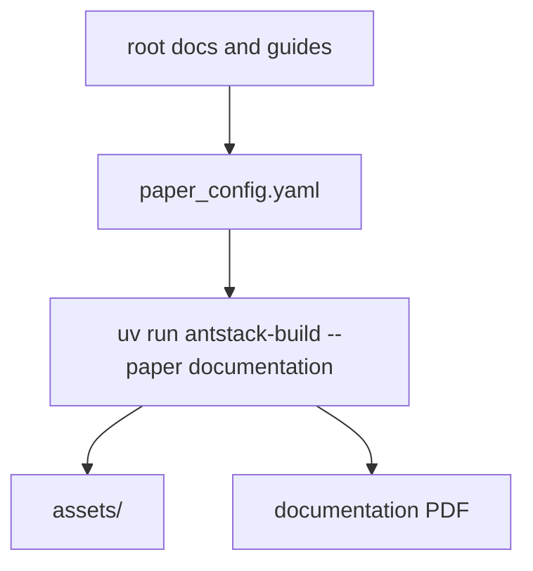

# Documentation Paper

This paper root documents the Ant Stack publication and PDF rendering workflow. It is validated through the shared `antstack-build` command.


```mermaid
flowchart TD
    Config["paper_config.yaml"] --> Build["uv run antstack-build --paper documentation"]
    Build --> Assets["assets/"]
    Build --> PDF["documentation PDF"]
    Docs["root docs and guides"] --> Config
```

## Local Commands

```bash
uv run antstack-build --paper documentation --validate-only
uv run antstack-build --validate-only
```

Full PDF builds require Pandoc and a XeLaTeX-capable TeX installation:

```bash
uv run antstack-build --paper documentation
```

## Notes

- Keep this README focused on the documentation paper root.
- General repository documentation lives under `docs/`.
- Root rendering guidance lives in `PDF_RENDERING_GUIDE.md`.
- Keep generated render intermediates under `assets/` only when they are intentional and reproducible.
