# 🐜 Ant Stack: Modular Scientific Publication System

**A comprehensive framework for reproducible scientific publications in embodied AI, featuring reusable analysis methods, automated validation, and professional presentation standards.**

[](https://github.com/your-repo/ant/actions)
[](https://github.com/your-repo/ant)
[](LICENSE)
[](https://www.python.org/)

---

## 📋 Table of Contents

- [🎯 Overview](#-overview)
- [🏗️ Architecture](#️-architecture)
- [📦 Core Package](#-core-package)
- [📄 Paper Structure](#-paper-structure)
- [🚀 Quick Start](#-quick-start)
- [🔧 Development](#-development)
- [📚 Documentation](#-documentation)
- [🤝 Contributing](#-contributing)
- [📄 License](#-license)

---

## 🎯 Overview

### Mission

Ant Stack provides a **modular, reproducible framework** for scientific publications in embodied AI, enabling researchers to:

- ✅ **Reuse validated analysis methods** across papers
- ✅ **Ensure reproducible results** through automated validation
- ✅ **Generate publication-quality figures** with consistent styling
- ✅ **Maintain scientific rigor** with statistical validation
- ✅ **Scale research workflows** with automated build pipelines

### Key Features

| Feature | Description |
|---------|-------------|
| **🔄 Reusability** | Modular analysis methods for energy estimation, statistics, and visualization |
| **📊 Quality Assurance** | Automated validation, cross-reference checking, and statistical verification |
| **🎨 Professional Output** | Publication-ready figures, LaTeX integration, and consistent formatting |
| **⚡ Performance** | Optimized algorithms with comprehensive benchmarking |
| **🔬 Scientific Rigor** | Bootstrap confidence intervals, uncertainty quantification, reproducibility |
| **🧪 Test-Driven** | 70%+ test coverage with comprehensive edge case testing |

### Applications

- **🤖 Embodied AI Research**: Energy analysis for robotic systems
- **🧠 Neuroscience**: Computational complexity of neural networks
- **⚡ Engineering**: Power optimization and scaling analysis
- **📈 Data Science**: Statistical validation and visualization

---

## 🏗️ Architecture

### System Components

```mermaid
graph TB
    A[📦 Core Package] --> B[Analysis Methods]
    A --> C[Figure Generation]
    A --> D[Publishing Tools]

    B --> B1[Energy Estimation]
    B --> B2[Statistical Validation]
    B --> B3[Workload Modeling]

    C --> C1[Publication Plots]
    C --> C2[Mermaid Processing]
    C --> C3[Cross-References]

    D --> D1[PDF Generation]
    D --> D2[Quality Validation]
    D --> D3[Template System]

    E[📄 Paper Structure] --> F[Ant Stack Framework]
    E --> G[Complexity Analysis]

    H[🔧 Build Pipeline] --> I[Unified Validation]
    H --> J[Quality Assurance]
    H --> K[Automated Testing]
```



---

## 📦 Core Package (`antstack_core/`)

### Analysis Module (`analysis/`)

| Component | Purpose | Key Features |
|-----------|---------|--------------|
| **`energy.py`** | Energy estimation and analysis | Physical modeling, efficiency calculations |
| **`statistics.py`** | Statistical methods and validation | Bootstrap CI, scaling relationships |
| **`workloads.py`** | Computational workload modeling | Body/brain/mind workload patterns |
| **`scaling_analysis.py`** | Scaling relationship analysis | Power laws, regime detection |
| **`enhanced_estimators.py`** | Advanced energy estimation | Multi-scale analysis, theoretical limits |
| **`experiment_config.py`** | Experiment configuration | YAML/JSON management, validation |

### Figures Module (`figures/`)

| Component | Purpose | Key Features |
|-----------|---------|--------------|
| **`plots.py`** | Publication-quality plotting | Matplotlib integration, styling |
| **`mermaid.py`** | Diagram preprocessing | Mermaid to PNG conversion |
| **`references.py`** | Cross-reference validation | Figure/table reference checking |
| **`assets.py`** | Asset management | File organization, optimization |

### Publishing Module (`publishing/`)

| Component | Purpose | Key Features |
|-----------|---------|--------------|
| **`pdf_generation.py`** | PDF generation utilities | Pandoc integration, LaTeX processing |
| **`templates.py`** | Document templates | Consistent formatting, styling |
| **`validation.py`** | Quality assurance | Automated checking, error detection |

---

## 📄 Paper Structure (`papers/`)

### Ant Stack Framework (`papers/ant_stack/`)

**Focus**: Biological framework for collective intelligence

| Section | File | Purpose |
|---------|------|---------|
| **📖 Introduction** | `Background.md` | Theoretical foundation |
| **🦿 Body Layer** | `AntBody.md` | Locomotion and sensing |
| **🧠 Brain Layer** | `AntBrain.md` | Neural processing and learning |
| **💭 Mind Layer** | `AntMind.md` | Decision making and planning |
| **🔧 Methods** | `Methods.md` | Implementation details |
| **📊 Results** | `Results.md` | Experimental validation |
| **💡 Applications** | `Applications.md` | Real-world use cases |
| **🗣️ Discussion** | `Discussion.md` | Implications and future work |

### Complexity Analysis (`papers/complexity_energetics/`)

**Focus**: Computational complexity and energy scaling

| Section | File | Purpose |
|---------|------|---------|
| **📖 Introduction** | `Background.md` | Problem statement |
| **🔬 Theory** | `Complexity.md` | Complexity analysis framework |
| | `Energetics.md` | Energy modeling approach |
| | `Scaling.md` | Scaling relationship theory |
| **🛠️ Methods** | `Methods.md` | Analysis methodology |
| **📊 Results** | `Generated.md` | Auto-generated analysis results |
| | `Results.md` | Interpretation and validation |
| **🗣️ Discussion** | `Discussion.md` | Scientific implications |

---

## 🚀 Quick Start

### Prerequisites

**System Requirements:**
- Python 3.8+
- Node.js 14+
- LaTeX distribution
- Pandoc 2.10+

### Installation

#### Ubuntu/Debian
```bash
# System dependencies
sudo apt-get update
sudo apt-get install -y pandoc texlive-xetex texlive-fonts-recommended fonts-dejavu nodejs npm

# Enhanced diagram rendering
sudo npm install -g mermaid-filter

# Python dependencies
pip3 install matplotlib numpy pandas pyyaml pytest scipy
```

#### macOS
```bash
# System dependencies
brew install pandoc node python3
brew install --cask mactex-no-gui

# Enhanced diagram rendering
npm install -g mermaid-filter

# Python dependencies
pip3 install matplotlib numpy pandas pyyaml pytest scipy
```

#### Development Setup
```bash
# Clone repository
git clone https://github.com/your-repo/ant.git
cd ant

# Install in development mode
pip install -e .

# Run tests
python -m pytest

# Build documentation
python scripts/build_docs.py
```

### Build Papers

#### Single Paper
```bash
# Ant Stack framework paper
python3 scripts/common_pipeline/build_core.py --paper ant_stack

# Complexity analysis paper
python3 scripts/common_pipeline/build_core.py --paper complexity_energetics
```

#### All Papers
```bash
# Build all papers
python3 scripts/common_pipeline/build_core.py

# With validation only
python3 scripts/common_pipeline/build_core.py --validate-only
```

### Basic Usage

```python
from antstack_core.analysis.energy import EnergyCoefficients, estimate_detailed_energy
from antstack_core.analysis.statistics import bootstrap_mean_ci

# Energy analysis example
coeffs = EnergyCoefficients()
workload = ComputeLoad(flops=1e9, memory_bytes=1e6)
energy = estimate_detailed_energy(workload, coeffs)

# Statistical validation
data = [1.2, 1.5, 1.3, 1.8, 1.4]
mean, ci_lower, ci_upper = bootstrap_mean_ci(data, n_bootstrap=1000)
```

---

## 🔧 Development

### Testing Strategy

**Test Coverage Goals:**
- **Core modules**: 80%+ coverage
- **Analysis methods**: 90%+ coverage
- **Edge cases**: Comprehensive coverage
- **Integration tests**: End-to-end validation

**Running Tests:**
```bash
# All tests
python -m pytest

# With coverage report
python -m pytest --cov=antstack_core --cov-report=html

# Specific module
python -m pytest tests/antstack_core/test_energy.py -v

# Performance benchmarks
python -m pytest tests/ --benchmark-only
```

### Code Quality Standards

**Linting and Formatting:**
```bash
# Run linters
python -m flake8 antstack_core/
python -m black antstack_core/
python -m isort antstack_core/

# Type checking
python -m mypy antstack_core/
```

**Pre-commit Hooks:**
```bash
# Install hooks
pre-commit install

# Run manually
pre-commit run --all-files
```

### Documentation

**Building Docs:**
```bash
# Generate API documentation
python scripts/generate_docs.py

# Build user guide
python scripts/build_user_guide.py

# Deploy to GitHub Pages
python scripts/deploy_docs.py
```

---

## 📚 Documentation

### User Guides

- **[Getting Started](docs/getting_started.md)**: Installation and basic usage
- **[API Reference](docs/api_reference.md)**: Complete method documentation
- **[Best Practices](docs/best_practices.md)**: Development guidelines
- **[Troubleshooting](docs/troubleshooting.md)**: Common issues and solutions

### Scientific Documentation

- **[Theoretical Foundation](docs/theory.md)**: Mathematical underpinnings
- **[Validation Framework](docs/validation.md)**: Quality assurance methods
- **[Benchmarking](docs/benchmarking.md)**: Performance analysis
- **[Reproducibility](docs/reproducibility.md)**: Ensuring scientific validity

### Developer Resources

- **[Contributing Guide](CONTRIBUTING.md)**: Development workflow
- **[Architecture Overview](docs/architecture.md)**: System design
- **[Testing Framework](docs/testing.md)**: Test development guide
- **[CI/CD Pipeline](docs/cicd.md)**: Build and deployment

---

## 🤝 Contributing

We welcome contributions! Please see our [Contributing Guide](CONTRIBUTING.md) for details.

### Development Workflow

1. **Fork** the repository
2. **Create** a feature branch: `git checkout -b feature/your-feature`
3. **Write tests** for new functionality
4. **Implement** your changes
5. **Run tests**: `python -m pytest`
6. **Update documentation** if needed
7. **Submit** a pull request

### Code Review Process

- All PRs require review
- Tests must pass CI pipeline
- Documentation updates required for API changes
- Maintain backward compatibility

### Issue Reporting

- Use [GitHub Issues](https://github.com/your-repo/ant/issues) for bug reports
- Provide minimal reproducible examples
- Include system information and error traces
- Follow issue templates for consistency

---

## 📄 License

This project is licensed under the MIT License - see the [LICENSE](LICENSE) file for details.

---

## 🙏 Acknowledgments

- **Scientific Contributors**: Domain experts in embodied AI and computational neuroscience
- **Open Source Community**: Libraries and tools that power this framework
- **Research Institutions**: Partners supporting reproducible science initiatives

---

## 📞 Contact

- **Issues**: [GitHub Issues](https://github.com/your-repo/ant/issues)
- **Discussions**: [GitHub Discussions](https://github.com/your-repo/ant/discussions)
- **Email**: research@your-institution.edu

---

*Built with ❤️ for reproducible science in embodied AI*
